# Jarvis — Full Architecture Reference

Load this file for deep feature work, refactoring, new API endpoints, and any
task that requires full context about the data model, API, stores, or state
transitions. Base rules and critical invariants live in the root `AGENTS.md`.

The rendered who-talks-to-whom data-flow diagram lives in
`docs/architecture.md` (source: `docs/diagrams/architecture-data-flow.mmd`,
re-render via `make diagrams`) — keep it in sync when the topology changes
(AGENTS.md workflow rule 12).

---

## Technology Decisions

| Decision | Why |
|---|---|
| `modernc.org/sqlite` + `pgx/v5` | Both are pure Go — no C compiler needed in container build (Podman/distroless) |
| `JARVIS_DB_DSN` selects dialect | Prefix `postgres://` → PostgreSQL via `pgx/v5/stdlib`; anything else → SQLite file path |
| No CGO | Container build with `CGO_ENABLED=0`, distroless final image has no C runtime |
| `//go:build prod` tag | `embed.FS` cannot compile a non-existent `dist/` directory — two files (prod/!prod) instead of one |
| TanStack Query WS patching | WS events patch the cache directly (`setQueryData`) — no extra refetch round-trip |
| Zustand v5 with `persist` | `viewMode` + `filters` persisted in localStorage, but URL params take precedence |

---

## Go Models (`internal/models/models.go`)

```go
// ── Alert ───────────────────────────────────────────────────────────────────
type AlertStatus struct {
    InhibitedBy []string `json:"inhibitedBy"`
    SilencedBy  []string `json:"silencedBy"`
    State       string   `json:"state"` // active | suppressed | unprocessed | resolved
}
type Receiver struct{ Name string `json:"name"` }
type EnrichedAlert struct {
    Fingerprint     string            `json:"fingerprint"`
    Status          AlertStatus       `json:"status"`
    Labels          map[string]string `json:"labels"`
    Annotations     map[string]string `json:"annotations"`
    StartsAt        time.Time         `json:"startsAt"`
    EndsAt          time.Time         `json:"endsAt"`
    UpdatedAt       time.Time         `json:"updatedAt"`
    GeneratorURL    string            `json:"generatorURL"`
    Receivers       []Receiver        `json:"receivers"`
    ClusterName     string            `json:"clusterName"`
    AlertmanagerURL string            `json:"alertmanagerUrl"`
    ActiveClaim     *Claim            `json:"activeClaim,omitempty"`
    SeenOn          []string          `json:"seenOn,omitempty"` // HA member names that reported this fingerprint; omitted for single-member clusters
}

// ── Silence ──────────────────────────────────────────────────────────────────
type SilenceMatcher struct {
    IsEqual bool   `json:"isEqual"`
    IsRegex bool   `json:"isRegex"`
    Name    string `json:"name"`
    Value   string `json:"value"`
}
type SilenceStatus struct{ State string `json:"state"` } // active | pending | expired
type Silence struct {
    ID              string           `json:"id"`
    Matchers        []SilenceMatcher `json:"matchers"`
    StartsAt        time.Time        `json:"startsAt"`
    EndsAt          time.Time        `json:"endsAt"`
    CreatedBy       string           `json:"createdBy"`
    Comment         string           `json:"comment"`
    Status          SilenceStatus    `json:"status"`
    UpdatedAt       time.Time        `json:"updatedAt"`
    ClusterName     string           `json:"clusterName"`
    AlertmanagerURL string           `json:"alertmanagerUrl"`
}

// ── History ──────────────────────────────────────────────────────────────────
// Status: firing | suppressed | expired | resolved
type AlertEvent struct {
    ID              int64      `json:"id"`
    Fingerprint     string     `json:"fingerprint"`
    ClusterName     string     `json:"clusterName"`
    AlertmanagerURL string     `json:"alertmanagerUrl"`
    Status          string     `json:"status"`
    StartsAt        time.Time  `json:"startsAt"`
    EndsAt          *time.Time `json:"endsAt"` // nil while firing
    Annotations     string     `json:"annotations"` // JSON
    RecordedAt      time.Time  `json:"recordedAt"`
}
type AlertStats struct {
    Fingerprint     string     `json:"fingerprint"`
    Alertname       string     `json:"alertname"`
    ClusterName     string     `json:"clusterName"`
    FirstSeenAt     time.Time  `json:"firstSeenAt"`
    LastSeenAt      time.Time  `json:"lastSeenAt"`
    LastFiredAt     *time.Time `json:"lastFiredAt,omitempty"`
    LastResolvedAt  *time.Time `json:"lastResolvedAt,omitempty"`
    OccurrenceCount int        `json:"occurrenceCount"`
}

// ── Timeline (merged alert + claim + silence history per alert) ───────────────
type AlertTimelineEntry struct {
    Source     string    `json:"source"` // alert | claim | silence
    SourceID   int64     `json:"sourceId"`
    RecordedAt time.Time `json:"recordedAt"`
    Who        string    `json:"who"`
    Action     string    `json:"action"`
    Comment    string    `json:"comment,omitempty"`
    SilenceID  string    `json:"silenceId,omitempty"`
}

// ── Comment ───────────────────────────────────────────────────────────────────
type Comment struct {
    ID          int64     `json:"id"`
    Fingerprint string    `json:"fingerprint"`
    ClusterName string    `json:"clusterName,omitempty"`
    EventID     *int64    `json:"eventId,omitempty"`
    UserID      *string   `json:"userId,omitempty"`   // set when auth enabled; nil for mode "none"
    AuthorName  string    `json:"authorName"`
    Body        string    `json:"body"`
    CreatedAt   time.Time `json:"createdAt"`
}

// ── Claim ─────────────────────────────────────────────────────────────────────
// Release reasons: manual | resolved | reclaimed | note_updated
type Claim struct {
    ID            int64      `json:"id"`
    Fingerprint   string     `json:"fingerprint"`
    ClusterName   string     `json:"clusterName"`
    EventID       *int64     `json:"eventId,omitempty"`
    ClaimedBy     string     `json:"claimedBy"`
    ClaimedAt     time.Time  `json:"claimedAt"`
    Note          string     `json:"note,omitempty"`
    ReleasedAt    *time.Time `json:"releasedAt,omitempty"`
    ReleasedBy    string     `json:"releasedBy,omitempty"`
    ReleaseReason string     `json:"releaseReason,omitempty"`
}

// ── WebSocket Events ──────────────────────────────────────────────────────────
type WSEvent struct {
    Type    string          `json:"type"`
    Payload json.RawMessage `json:"payload"`
}
const (
    WSTypeAlertsUpdate  = "alerts_update"   // payload: { alerts: EnrichedAlert[] }
    WSTypeClaimSet      = "claim_set"        // payload: { fingerprint, clusterName, claim }
    WSTypeClaimReleased = "claim_released"   // payload: { fingerprint, clusterName, releasedBy }
    WSTypeCommentAdded  = "comment_added"    // payload: { fingerprint, comment }
    WSTypeSilencesUpdate = "silences_update" // payload: {} — pure invalidation signal
)

// ── SilenceEvent (history of silence actions per alert) ───────────────────────
// Action: pending | created | updated | deleted | expired
type SilenceEvent struct {
    ID          int64     `json:"id"`
    Fingerprint string    `json:"fingerprint"`
    SilenceID   string    `json:"silenceId"`
    ClusterName string    `json:"clusterName"`
    Action      string    `json:"action"`
    PerformedBy string    `json:"performedBy"`
    Comment     string    `json:"comment"`
    RecordedAt  time.Time `json:"recordedAt"`
}

// ── SilenceTemplate (reusable matcher blueprint, shared across users) ─────────
type SilenceTemplate struct {
    ID        string           `json:"id"`
    Name      string           `json:"name"`
    Matchers  []SilenceMatcher `json:"matchers"`
    Reason    string           `json:"reason"`
    CreatedAt time.Time        `json:"createdAt"`
}

// ── Cluster ───────────────────────────────────────────────────────────────────
type ClusterInfo struct {
    Name            string       `json:"name"`
    AlertmanagerURL string       `json:"alertmanagerUrl"` // first member's browser-visible URL
    PrometheusURL   string       `json:"prometheusUrl"`
    Healthy         bool         `json:"healthy"` // true when >=1 member is up
    AlertCount      int          `json:"alertCount"`
    Members         []MemberInfo `json:"members,omitempty"` // HA clusters only (2+ members); omitted for single-member clusters
}
type MemberInfo struct {
    Name    string `json:"name"` // host:port
    URL     string `json:"url"`  // browser-visible URL (HOST_ALIAS-rewritten)
    Healthy bool   `json:"healthy"`
}

// ── AlertGroup ────────────────────────────────────────────────────────────────
type AlertGroup struct {
    Alertname string          `json:"alertname"`
    Severity  string          `json:"severity"`
    Alerts    []EnrichedAlert `json:"alerts"`
    Count     int             `json:"count"`
}
```

User types live **outside** `models.go`:

- `internal/users/store.go` — DB `User` (ID, Username, Email, PasswordHash
  (bcrypt, empty for OIDC-only), Role `user|admin`, Provider `internal|oidc`,
  OIDCSub, CreatedAt, LastLoginAt) + `CreateUser`.
- `internal/auth/provider.go` — session `User` (ID, Username, Email, Role,
  Provider) and `ProviderInfo` (mode, loginUrl, setupRequired, authMode,
  runbookBaseUrl — returned by `GET /auth/info`).
- Frontend mirrors: `AuthUser`, `ProviderInfo`, `AdminUser` in
  `frontend/src/types/index.ts`.

---

## Database Schema (`internal/db/migrate_sqlite.go` + `migrate_postgres.go`)

Both dialects are kept in parity. SQLite uses `AUTOINCREMENT` / `datetime('now')`; PostgreSQL uses
`BIGSERIAL` / `now()` and `ADD COLUMN IF NOT EXISTS`. `rebind()` converts `?` → `$N` for PostgreSQL.

```sql
CREATE TABLE IF NOT EXISTS alert_fingerprints (
    fingerprint      TEXT PRIMARY KEY,
    alertname        TEXT NOT NULL,
    cluster_name     TEXT NOT NULL,
    labels           TEXT NOT NULL,     -- JSON
    first_seen_at    DATETIME NOT NULL,
    last_seen_at     DATETIME NOT NULL,
    occurrence_count INTEGER DEFAULT 1
);

CREATE TABLE IF NOT EXISTS alert_events (
    id               INTEGER PRIMARY KEY AUTOINCREMENT,
    fingerprint      TEXT NOT NULL REFERENCES alert_fingerprints(fingerprint),
    cluster_name     TEXT NOT NULL,
    alertmanager_url TEXT NOT NULL,
    status           TEXT NOT NULL, -- firing | suppressed | expired | resolved
    starts_at        DATETIME NOT NULL,
    ends_at          DATETIME,          -- NULL while firing
    annotations      TEXT,              -- JSON
    recorded_at      DATETIME NOT NULL DEFAULT (datetime('now'))
);

CREATE TABLE IF NOT EXISTS alert_comments (
    id           INTEGER PRIMARY KEY AUTOINCREMENT,
    fingerprint  TEXT NOT NULL REFERENCES alert_fingerprints(fingerprint),
    event_id     INTEGER REFERENCES alert_events(id),
    author_name  TEXT NOT NULL,
    body         TEXT NOT NULL,
    created_at   DATETIME NOT NULL DEFAULT (datetime('now')),
    user_id      TEXT,                        -- added via ALTER; NULL in mode "none"
    cluster_name TEXT NOT NULL DEFAULT ''     -- added via ALTER; originating cluster, '' for legacy rows
);

CREATE TABLE IF NOT EXISTS alert_claims (
    id             INTEGER PRIMARY KEY AUTOINCREMENT,
    fingerprint    TEXT NOT NULL REFERENCES alert_fingerprints(fingerprint),
    cluster_name   TEXT NOT NULL DEFAULT '',  -- claims scoped per (fingerprint, cluster); '' for legacy rows
    event_id       INTEGER REFERENCES alert_events(id),
    claimed_by     TEXT NOT NULL,
    claimed_at     DATETIME NOT NULL DEFAULT (datetime('now')),
    note           TEXT,
    released_at    DATETIME,
    released_by    TEXT,
    release_reason TEXT  -- manual | resolved | reclaimed | note_updated
);

CREATE TABLE IF NOT EXISTS silence_events (
    id           INTEGER PRIMARY KEY AUTOINCREMENT,
    fingerprint  TEXT NOT NULL,
    silence_id   TEXT NOT NULL,
    cluster_name TEXT NOT NULL,
    action       TEXT NOT NULL,  -- pending | created | updated | deleted | expired
    performed_by TEXT NOT NULL,
    comment      TEXT NOT NULL DEFAULT '',
    recorded_at  DATETIME NOT NULL DEFAULT (datetime('now'))
);

CREATE TABLE IF NOT EXISTS silence_templates (
    id         TEXT PRIMARY KEY,
    name       TEXT NOT NULL UNIQUE,
    matchers   TEXT NOT NULL,           -- JSON
    reason     TEXT NOT NULL DEFAULT '',
    created_at DATETIME NOT NULL DEFAULT (datetime('now'))
);

CREATE TABLE IF NOT EXISTS users (
    id            TEXT PRIMARY KEY,
    username      TEXT NOT NULL UNIQUE,
    email         TEXT,
    password_hash TEXT,                 -- bcrypt; NULL for OIDC users
    role          TEXT NOT NULL DEFAULT 'user',      -- user | admin
    provider      TEXT NOT NULL DEFAULT 'internal',  -- internal | oidc
    oidc_sub      TEXT UNIQUE,
    created_at    DATETIME NOT NULL,
    last_login_at DATETIME
);

-- Indexes
CREATE INDEX IF NOT EXISTS idx_alert_events_fingerprint          ON alert_events(fingerprint);
CREATE INDEX IF NOT EXISTS idx_alert_events_starts_at            ON alert_events(starts_at DESC);
CREATE INDEX IF NOT EXISTS idx_alert_events_fingerprint_recorded ON alert_events(fingerprint, recorded_at DESC);
CREATE INDEX IF NOT EXISTS idx_alert_comments_fingerprint        ON alert_comments(fingerprint);
CREATE INDEX IF NOT EXISTS idx_alert_claims_fingerprint          ON alert_claims(fingerprint);
CREATE INDEX IF NOT EXISTS idx_alert_claims_active               ON alert_claims(fingerprint, cluster_name) WHERE released_at IS NULL;
CREATE INDEX IF NOT EXISTS idx_silence_events_fingerprint        ON silence_events(fingerprint, recorded_at DESC);
CREATE INDEX IF NOT EXISTS idx_users_username                    ON users(username);
CREATE INDEX IF NOT EXISTS idx_users_oidc_sub                    ON users(oidc_sub);

-- PostgreSQL only (tmp/fable/multi-replica.md D3) — SQLite never creates or
-- reads this table (single replica, no followers to feed).
CREATE TABLE IF NOT EXISTS poll_snapshots (
    cluster_name TEXT PRIMARY KEY,
    payload      BYTEA NOT NULL,
    taken_at     TIMESTAMPTZ NOT NULL
);
```

**SQLite settings** (on open): `SetMaxOpenConns(1)`, `PRAGMA journal_mode=WAL`, `PRAGMA foreign_keys=ON`, `PRAGMA busy_timeout=5000`. PostgreSQL uses the default pool (no `SetMaxOpenConns(1)`).

---

## API Endpoints

Auth column: **None** = public · **Auth** = `RequireAuth` (valid JWT) · **Admin** = `RequireAdmin` (role=admin).
When `JARVIS_AUTH_MODE=full_protect`, **all** `/api/v1/*` routes additionally require auth (the `full_protect?`
marker below). Write routes are rate-limited (`writeRL` = 30/min, burst 10); `/poll` is limited to 1 req/5s
(relaxed in `-tags e2e` builds).

**Cluster scoping**: all `/alerts/:fingerprint/*` routes accept `?cluster=<name>` —
the same fingerprint can exist in multiple clusters, so history, stats, comments,
and claims are isolated per cluster. Frontend hooks pass `clusterName` accordingly.

Global middleware (all responses): `Secure` headers (X-XSS-Protection, nosniff,
X-Frame-Options SAMEORIGIN, HSTS, CSP `default-src 'self'; …`), body limit 1 MB,
CORS from `JARVIS_ALLOWED_ORIGINS` (credentials allowed).

```
# ── Health / Metrics / Auth / Setup ──────────────────────────────────────────
GET    /health                                   None        → { status: "ok" }
GET    /metrics                                  None        → Prometheus exposition format (see internal/metrics below)
GET    /auth/info                                None        → { mode, loginUrl, setupRequired, runbookBaseUrl }
POST   /auth/login                               None  (RL)  Body: { username, password } → user + Set-Cookie
POST   /auth/logout                              None        → clears session cookie
GET    /auth/me                                  Auth        → User
GET    /auth/oidc/start                          None        → 302 redirect to OIDC issuer (PKCE)
GET    /auth/oidc/callback                       None        → exchanges code, sets cookie, 302 → /
POST   /setup                                    None  (RL)  Body: { username, password } (internal mode only; 403 if users exist)

# ── WebSocket ────────────────────────────────────────────────────────────────
WS     /ws                                       full_protect?  (origin checked against JARVIS_ALLOWED_ORIGINS;
#        in full_protect mode the upgrade request additionally requires a valid
#        session cookie via RequireAuth — /ws streams the full alert snapshot)

# ── Status / Version ─────────────────────────────────────────────────────────
GET    /api/v1/status                            full_protect?  → { status, clusters, alerts, ws_clients, leader }
#        leader: this pod's current leader-election state (internal/leader) — always true on SQLite
GET    /api/v1/info                              full_protect?  → { version }

# ── Alerts (in-memory AlertStore) ────────────────────────────────────────────
GET    /api/v1/alerts/groups                     full_protect?  → []AlertGroup   ← register BEFORE :fingerprint/*!
GET    /api/v1/alerts                            full_protect?  → []EnrichedAlert  ?cluster= ?severity= ?state=

# ── Alert details (history store / DB) ───────────────────────────────────────
GET    /api/v1/alerts/:fingerprint/history       full_protect?  → { events: AlertEvent[], total }  ?limit= ?offset= ?cluster=
GET    /api/v1/alerts/:fingerprint/timeline      full_protect?  → []AlertTimelineEntry  (merged alert+claim+silence history)
GET    /api/v1/alerts/:fingerprint/stats         full_protect?  → AlertStats  ?cluster=
GET    /api/v1/alerts/:fingerprint/heatmap       full_protect?  → AlertHeatmapResponse  ?cluster= &range=24h|7d|30d (required)
#        firing-event timestamps (recorded_at of status='firing' alert_events rows, one per
#        distinct starts_at episode — a silence expiring mid-episode replays as a fresh firing row
#        with the *same* starts_at, so GetFiringStarts dedupes by starts_at; the 60s grace period
#        only covers resolve+refire, not this suppressed/expired/firing sequence), capped at 10000,
#        newest first. Uses recorded_at (when Jarvis observed the event), not starts_at (AM's
#        upstream condition-start time), so heatmap buckets agree with "Last fired" / history log
#        for the same event
#        internally; range maps to a lookback window (24h/7d/30d). Bucketing into hourly/daily
#        cells happens entirely in the frontend (lib/heatmapUtils.ts bucketFiringStarts) so
#        day/hour boundaries use the browser's local timezone, not the server's.
GET    /api/v1/alerts/:fingerprint/silence-events full_protect? → []SilenceEvent   (silence action timeline)

# ── Comments ─────────────────────────────────────────────────────────────────
GET    /api/v1/alerts/:fingerprint/comments      full_protect?  → { comments: Comment[], total }  ?limit= ?offset= ?cluster= (required)
#        mirrors the history/timeline pagination pattern: default limit 20, max 100, offset >= 0
#        (parseFingerprintClusterPagination); ORDER BY created_at DESC, id DESC (newest first)
POST   /api/v1/alerts/:fingerprint/comments      Auth  (write)  Body: { authorName, body, eventId? }  (body capped at 10000 chars → 400)
DELETE /api/v1/alerts/:fingerprint/comments/:id  Auth  (write)  (author-gated: user_id, else author_name)

# ── Claims ───────────────────────────────────────────────────────────────────
GET    /api/v1/alerts/:fingerprint/claim         full_protect?  → Claim | null  ?cluster=
POST   /api/v1/alerts/:fingerprint/claim         Auth  (write)  Body: { claimedBy, note?, eventId? }
PATCH  /api/v1/alerts/:fingerprint/claim/note    Auth  (write)  Body: { note }  (edit note of active claim)
DELETE /api/v1/alerts/:fingerprint/claim         Auth  (write)  ?by=username
GET    /api/v1/alerts/:fingerprint/claims/history full_protect? → []Claim  ?cluster=

# ── Silences (reads from in-memory SilenceStore; writes → Alertmanager) ──────
GET    /api/v1/silences                          full_protect?  → []Silence  ?cluster=
#        served entirely from history.SilenceStore (filled by the recorder poll) — NEVER calls
#        Alertmanager. A cluster whose poll-time silence fetch fails keeps its previous snapshot.
#        Silences created/expired directly in AM appear within one JARVIS_POLL_INTERVAL.
POST   /api/v1/silences                          Auth  (write)  → { id }
#        validated server-side before the AM call (silence_validation.go validateSilenceMatchers):
#        ≥1 matcher, no empty matcher names, every regex must compile (Go regexp = RE2, same
#        engine as AM — accepts syntax like `(?i)` that a browser's JS RegExp rejects), ≥1 matcher
#        must not match the empty string, endsAt > startsAt, endsAt > now
#        AM 4xx response (e.g. its own validation rejection) → relayed as 400 with a sanitized
#        message (sanitizeAMMessage); AM 5xx/transport failure → generic 502
#        id set → update (AM may return a NEW id; the old silence is then expired to avoid duplicates)
#        fingerprint set → SilenceEvent recorded (action: created | updated | pending when startsAt is in the future)
#        when auth mode ≠ none: createdBy/performedBy forced to the session username
#        on success: write-through into SilenceStore (Upsert new + MarkExpired old id on id change)
#        + poll trigger, so the frontend's immediate refetch sees the change (applySilenceWriteThrough)
DELETE /api/v1/silences/:id                      Auth  (write)  ?cluster= (required) &fingerprint= &by=  → records "deleted" event
#        AM 4xx response → relayed as 400 (sanitized); AM 5xx/transport failure → generic 502
#        on success: SilenceStore.MarkExpired + poll trigger (same write-through pattern)

# ── Silence Templates (DB, shared) ───────────────────────────────────────────
GET    /api/v1/silence-templates                 full_protect?  → []SilenceTemplate
POST   /api/v1/silence-templates                 Auth  (write)  Body: { name, matchers[], reason? }  — validateSilenceMatchers applies
PUT    /api/v1/silence-templates/:id             Auth  (write)  Body: { name, matchers[], reason? }  — validateSilenceMatchers applies
DELETE /api/v1/silence-templates/:id             Auth  (write)

# ── Poll / Clusters ──────────────────────────────────────────────────────────
POST   /api/v1/poll                              None  (RL)   → triggers an immediate Alertmanager poll
GET    /api/v1/clusters                          full_protect?  → []ClusterInfo
#        health from the cached per-member up-state of the last poll (Cluster.MemberUpStates) —
#        never live-pings AM; members without poll state yet count as healthy (writeOrder optimism)

# ── Admin (auth + role=admin) ────────────────────────────────────────────────
GET    /api/v1/admin/users                       Admin        → []User
POST   /api/v1/admin/users                       Admin (RL)   Body: { username, password, role }
PATCH  /api/v1/admin/users/:id                   Admin        Body: { role }  (cannot change own role)
DELETE /api/v1/admin/users/:id                   Admin        (cannot delete self)

# ── E2E test routes (only with -tags e2e; no-op in production builds) ────────
POST   /api/v1/test/reset                        (e2e only)  truncate history tables + clear in-memory stores (alerts + silences)
POST   /api/v1/test/seed                         (e2e only)  insert resolved-alert lifecycles
POST   /api/v1/test/claim                        (e2e only)  set claim, bypasses auth
POST   /api/v1/test/comment                      (e2e only)  add comment, bypasses auth (no WS broadcast)
POST   /api/v1/test/silence                      (e2e only)  create silence in AM, bypasses auth (same SilenceStore write-through as production)
POST   /api/v1/test/template                     (e2e only)  create silence template, bypasses auth

# ── Static (production build tag only) ───────────────────────────────────────
GET    /*                                         None        → embed.FS (Vite build); SPA fallback to index.html
                                                              firstRunRedirect → /setup when internal mode + no users
```

---

## Metrics (`internal/metrics`)

Prometheus metrics on an injected `*prometheus.Registry` (never the global
default one — that would panic on duplicate registration across parallel Go
tests). `metrics.New(version)` builds it, including the standard Go/process
collectors and `jarvis_build_info`. `Metrics.Handler()` serves `GET /metrics`.

- `collector.go` — `storeCollector` (`prometheus.Collector`): computes
  `jarvis_alerts`, `jarvis_alerts_by_severity`, `jarvis_ws_clients`,
  `jarvis_clusters_configured`, and `jarvis_alertmanager_up` (labeled
  `cluster`, `member`) at scrape time from the in-memory `AlertStore`, the WS
  `Hub`, and the recorder's cached `ClusterUpStates() map[string]map[string]bool`
  (cluster → member → up, sourced from each `cluster.Cluster.MemberUpStates()`)
  — `Collect()` never makes an upstream HTTP call itself.
- `echo.go` — `Metrics.EchoMiddleware()`: records `jarvis_http_requests_total`
  / `jarvis_http_request_duration_seconds`, labeled by Echo route pattern
  (`c.Path()`, never the raw URL) to keep cardinality bounded. Skips
  `/metrics`, `/health`, `/ws`.
- Event counters `jarvis_poll_cycles_total`, `jarvis_poll_errors_total`,
  `jarvis_poll_duration_seconds`, `jarvis_cluster_fetch_duration_seconds`,
  `jarvis_alert_events_total` live on `history.Recorder`;
  `jarvis_ws_broadcasts_total` lives on `ws.Hub`. Both
  `history.NewRecorder(...)` and `ws.NewHub(...)` take a trailing
  `*metrics.Metrics` argument that is nil-safe (same pattern as the existing
  `pollTrigger` nil-check in `triggerPoll`) — most tests construct the
  Recorder/Hub via other paths and don't need to pass one.
- Every metric that can meaningfully be attributed to one Alertmanager cluster
  carries a `cluster` label (`jarvis_poll_cycles_total`, `_errors_total`,
  `_alert_events_total`, `jarvis_alerts*`). `jarvis_alertmanager_up` and
  `jarvis_cluster_fetch_duration_seconds` additionally carry a `member` label
  (HA-cluster support) — single-member clusters emit their one member, so
  existing `sum by (cluster) (...)` queries are unaffected; only queries
  asserting the exact label set need updating (see `docs/metrics.md`).
  `jarvis_poll_duration_seconds` is the one deliberate exception with no
  per-cluster label — it measures the *whole* poll cycle (all clusters in
  parallel + the shared DB write in `applyPollResults`), so a per-cluster
  label would misrepresent it; `jarvis_cluster_fetch_duration_seconds` is the
  per-member counterpart for isolating a slow upstream Alertmanager member.
- `jarvis_leader` (gauge 0/1): this pod's current leader-election state — see
  `internal/leader` section below. Always 1 on SQLite.
- `jarvis_snapshot_stale` (gauge 0/1): whether a follower's consumed poll
  snapshot is older than 3× `JARVIS_POLL_INTERVAL` — see leader-only
  polling below. Always 0 while leader or on SQLite.
- Full metric reference for operators: `docs/metrics.md`.

---

## Data Retention Sweeper (`internal/retention`)

Optional, env-var-only background deletion of old rows — user-facing docs:
`docs/retention.md`; config: `Config.Retention` above.

- `Sweeper` (`sweeper.go`), built via `retention.NewSweeper(store,
  cfg.Retention, logger, m)` in `main.go`, started as `go
  sweeper.Start(ctx)` alongside `recorder.Start(ctx)`. Its `store` param is
  a small interface (not `*history.Store` directly) so it's testable
  without a DB — `*history.Store` satisfies it structurally.
- `Start` is a **no-op** when `cfg.Retention.Enabled()` is `false` (the
  default) — no timer, no query, ever. Otherwise the first sweep runs 1
  minute after `Start` (doesn't compete with boot), then every
  `cfg.Retention.SweepInterval`.
- `sweep()` runs domains in FK-safe order: comments (if
  `EffectiveCommentsDays() > 0`) → released claims → silence events →
  detach comment/claim survivors from soon-to-be-deleted events → events →
  orphan fingerprints last (cutoff = the **widest** of all four effective
  retentions, since a fingerprint may only vanish once nothing anywhere
  still references it). One domain's error is logged and does **not**
  abort the others.
- `history/store_retention.go` holds the six store methods the Sweeper
  calls, all batched (500 rows, `batchDeleteLoop`, short pause between
  batches — Critical Invariant #8, SQLite single writer) and
  context-cancellable:
  `DeleteSweepableEventsBefore`, `DetachCommentsAndClaimsFromSweepableEventsBefore`,
  `DeleteReleasedClaimsBefore`, `DeleteCommentsBefore`,
  `DeleteSilenceEventsBefore`, `DeleteOrphanFingerprintsBefore`.
- `sweepableEventsCondition` (shared SQL fragment, same file) decides which
  `alert_events` rows are safe to delete: the episode is already closed
  (`resolved`/`expired`), OR a newer event exists for the same
  `(fingerprint, cluster_name)` (this row is superseded). It deliberately
  does **not** use `ends_at` — no INSERT ever writes it, it's always NULL —
  and never matches the newest row of a still-`firing`/`suppressed`
  episode, however old, since the recorder only writes rows on status
  *changes*.
- Metrics: `jarvis_retention_sweeps_total`,
  `jarvis_retention_deleted_rows_total{table}`,
  `jarvis_retention_sweep_duration_seconds` (`docs/metrics.md`).
- Known accepted side effect: a fingerprint's **global** `occurrence_count`
  survives event deletion (lives on `alert_fingerprints`), but **per-cluster**
  stats/heatmap are derived live from `alert_events` and shrink to the
  retention window after a sweep. If a fingerprint survives only via a
  surviving comment and later re-fires, `RecordStatusChange` finds no prior
  event and does not increment `occurrence_count` (also doesn't reset it).

---

## Leader Election (`internal/leader`)

Multi-replica groundwork (full design: `tmp/fable/multi-replica.md`). Exactly
one pod at a time may run the leader-only side effects listed below; every
pod still serves reads/API/WS equally regardless of leadership.

- `Elector` interface: `IsLeader() bool`, `Run(ctx)`, `Subscribe(fn
  func(isLeader bool))`. `Subscribe` — not a single channel — because there
  are two independent consumers (`history.Recorder`'s promotion hook today;
  the pod labeler in a later slice). Callbacks run sequentially on the
  elector's own goroutine and must not block.
- `StaticElector` (SQLite dialect): always leader, `Subscribe` fires
  `fn(true)` once immediately. SQLite is single-writer/single-replica by
  design (Critical Invariant #8), so there is never a follower to coordinate
  with.
- `PGElector` (PostgreSQL dialect): a dedicated connection (never the shared
  pool) holds `pg_try_advisory_lock(0x4A525653, 1)`. Follower retry and
  leader heartbeat both run on a 5s interval (`AcquireRetryInterval` /
  `HeartbeatInterval`, overridable per-instance via `SetRetryInterval` for
  fast tests — production leaves it at the default). The dedicated
  connection dials through a `net.Dialer` with `KeepAliveConfig` (idle 5s,
  interval 3s, count 3) so a hard node failure is detected and the session
  lock released within a bounded time instead of the OS-default keepalive
  timeout. Losing the connection releases the PostgreSQL session lock
  automatically — no TTL bookkeeping needed for a crashed/killed leader.
  `Subscribe` fires immediately with the current state (like
  `StaticElector`), including the not-yet-connected initial `false` before
  `Run` has acquired anything — callers must treat that as "not leader (yet)",
  not "was just demoted".
- Wired in `cmd/jarvis/main.go`: `StaticElector` or `PGElector` chosen by
  `db.DetectDialect`, always on with PostgreSQL (no escape-hatch env var),
  `go el.Run(ctx)` alongside the recorder/sweeper goroutines.
- `history.Recorder` holds a narrow local `elector` interface (`IsLeader()`,
  `Subscribe(...)`, structurally satisfied by `*leader.PGElector`/
  `*leader.StaticElector` — mirrors `retention.Sweeper`'s narrow `store`
  interface, so `history` doesn't import `internal/leader`). `nil` means
  "always leader" (the pre-multi-replica default, used by every test that
  constructs a `Recorder` directly). Gated side effects (all in
  `applyPollResults`/`poll`, only reachable while leader — see leader-only
  polling below): `UpsertFingerprint` + `RecordStatusChange`,
  `RecordResolvedForCluster`, the delayed claim-release goroutine
  (re-checks `IsLeader()` again at fire time — leadership can change during
  `claimReleaseDelay`), `reconcileStartupResolves` (guarded via
  `reconciledClusters[cluster]`, which a follower never marks done — so the
  moment a pod is promoted, its very next poll, triggered immediately by the
  promotion hook via `Trigger()`, reconciles exactly once), external-silence
  event recording. Not gated: in-memory `AlertStore`/resolved-buffer
  bookkeeping and the WS broadcasts — every pod keeps serving its own
  clients regardless of leadership (fed by its own poll while leader, by
  consumed snapshots while follower — see below).
- `retention.Sweeper` holds the same narrow-interface pattern (`leaderChecker
  { IsLeader() bool }`); `Start`'s sweep tick calls `shouldSweep()` first — a
  follower skips the sweep entirely (a `nil` elector always sweeps, same
  default-leader convention as above).
- Metric: `jarvis_leader` (gauge 0/1), set from `Recorder`'s
  `onLeadershipChange` (the elector's `Subscribe` callback). Also surfaced in
  `GET /api/v1/status` as `"leader": bool` (via the `pollTriggerer` interface,
  which `Recorder` satisfies alongside `Trigger()`).

### Leader-only polling + snapshot distribution (D3, PostgreSQL only)

Alertmanager load must not scale with `replicaCount`: only the leader ever
polls; followers reconstruct their stores from PostgreSQL instead.

- `Recorder.Start` seeds resolved alerts, then picks a mode. SQLite (or a
  Recorder built without an elector/dsn, e.g. most unit tests) always calls
  `runPollLoop` — today's unconditional-poll behavior, unchanged. On
  PostgreSQL, a **mode supervisor** subscribes a second callback to the
  elector (alongside `onLeadershipChange`'s metrics/trigger callback) that
  cancels whichever loop is currently running and starts the other
  (`runPollLoop` while leader, `runFollowerLoop` while follower) on every
  transition, including the very first (immediate) `Subscribe` callback.
- `runPollLoop` is the pre-multi-replica ticker/trigger loop, plus (dialect
  PostgreSQL) a background `listenLoop` on the `jarvis_trigger` channel: a
  follower's forwarded `Trigger()` call reaches the leader this way and is
  turned into a local trigger (`triggerLocal`) without waiting for the next
  tick.
- After each successful `poll()` → `applyPollResults()`, the leader calls
  `persistSnapshots`: for every configured cluster, gzip'd-JSON-encode
  `{alerts, silences, memberUp}` (Resolved Decision 3) from the just-updated
  `AlertStore`/`SilenceStore`/`cluster.Cluster.MemberUpStates()`, upsert it
  into `poll_snapshots` (`Store.PersistSnapshot`), then
  `pg_notify('jarvis_snapshot', clusterName)` (`Store.NotifySnapshotChanged`).
  No-ops on SQLite (`Store`'s snapshot methods self-guard on dialect; the
  loop only calls them when `Recorder.dsn != ""`, which main.go only sets
  for PostgreSQL).
- `runFollowerLoop` never polls Alertmanager. On start it does a full resync
  (`resyncAllSnapshots`: `Store.GetAllSnapshots` → decode every cluster's
  row), then runs a `listenLoop` on `jarvis_snapshot`: each notification's
  payload is the changed cluster's name, resynced individually
  (`resyncSnapshot` → `Store.GetSnapshot`); a full resync also runs
  periodically as a NOTIFY-miss fallback (`listenLoop`'s `onIdle`, firing
  every `JARVIS_POLL_INTERVAL` if no notification arrived). Every decoded
  cluster's silences go straight into `SilenceStore` (already the per-cluster
  cache); alerts are cached per-cluster in `Recorder.followerSnapshots`
  (`followerMu`-guarded) and re-merged into the whole `AlertStore` on every
  update (`rebuildFollowerAlertStore` — `AlertStore.Set` always replaces the
  full store, so a per-cluster update must re-merge everything), then
  broadcasts via the existing `broadcastAlertsIfChanged`.
- `Recorder.ClusterUpStates()` (the metrics-collector-facing view) sources
  member up-states from `followerSnapshots` while follower instead of the
  local (never-polled) `cluster.Cluster.MemberUpStates()` — a follower still
  reports accurate cluster health, borrowed from the leader's snapshot.
- Staleness: `rebuildFollowerAlertStore` compares each cached snapshot's
  `takenAt` against `3 × JARVIS_POLL_INTERVAL` (Binding Constant) and sets
  `jarvis_snapshot_stale` (gauge 0/1) accordingly; a promotion resets it to 0
  (`onLeadershipChange`).
- `Recorder.Trigger()`: while leader, enqueues locally (`triggerLocal`,
  unchanged); while follower, calls `Store.NotifyTrigger` (`pg_notify`,
  channel `jarvis_trigger`) instead of touching its own (suspended) poll
  loop — this is what the leader's `runPollLoop` listener above consumes.
- `listenLoop`/`dialListener`/`consumeNotifications` (in
  `recorder_snapshot.go`) are Recorder-local — a dedicated (non-pooled) `pgx.Conn`
  per LISTEN, same TCP-keepalive bound as the elector (D2: idle 5s/interval
  3s/count 3), `LISTEN <channel>` once, then `WaitForNotification` in a loop
  with a `resyncInterval` timeout standing in for the periodic fallback;
  reconnects with a fresh LISTEN on connection loss. `history` still doesn't
  import `internal/leader` (pgx is used directly, same as `leader.PGElector`
  does internally) — this is a separate, parallel use of the same driver,
  not a dependency on that package.
- Test harness: `internal/history/recorder_multireplica_test.go` runs two
  full `Recorder`s, each with its own real `leader.PGElector`, sharing one
  PostgreSQL test database and one fake Alertmanager
  (`JARVIS_TEST_POSTGRES_DSN`-gated) — exactly one polls, the other converges
  via snapshots without ever touching its own `cluster.Cluster`, a leader
  kill promotes the follower which then polls and reconciles, a
  resolve+refire pair straddling the handoff still reopens under the grace
  period (Critical Invariant #1 regression-tested across a leadership
  change), and a follower's `Trigger()` reaches the leader well under the
  configured poll interval.

### Cross-pod WS mutation fanout (`internal/fanout`, D4, PostgreSQL only)

Snapshot distribution (D3, above) keeps alert-state broadcasts consistent
across pods for free — every pod already derives `alerts_update`/the
poll-time `silences_update` from its own poll or consumed snapshot. It does
**not** cover mutation-driven broadcasts (a comment added, a claim set, a
silence created/deleted via the API) — those originate on whichever pod
handled the HTTP request and must still reach every other pod's WS clients.
`internal/fanout` is the separate, narrower mechanism for exactly that.

- `Fanout` interface: `Publish(ctx, message []byte, ref Ref)`,
  `Run(ctx, onMessage func([]byte), onRef func(Ref))`. `Ref{Type,
  Fingerprint, ClusterName, ID}` identifies a mutation well enough for the
  receiving pod to look the row back up itself.
- `NoopFanout` (SQLite dialect): `Publish` does nothing, `Run` blocks on
  `ctx.Done()` — single replica, no other pod to fan out to.
- `PGFanout` (PostgreSQL dialect): publishes via `pg_notify('jarvis_ws',
  ...)` on the existing pooled `*sql.DB` (NOTIFY is a cheap statement, no
  dedicated connection needed to publish); `Run` opens its own dedicated
  LISTEN connection (same TCP-keepalive bound as D2/D3: idle 5s/interval
  3s/count 3). The wire envelope is `{origin, message?, ref?}` — `origin` is
  a random `uuid.NewString()` generated once per `PGFanout` instance, and
  `consume` skips any notification whose `origin` matches its own (echo
  suppression: without this, a pod would receive its own `Publish` back from
  PostgreSQL, since NOTIFY delivers to every listening session including the
  one that sent it — not just "other" ones). Fire-and-forget: unlike
  snapshot distribution there is no durable resync fallback here; a missed
  NOTIFY just skips that one live update; the next natural refetch still
  converges.
- Payload-size fallback: PostgreSQL's NOTIFY payload limit is ~8000 bytes.
  If the encoded envelope with the full `message` would exceed
  `maxNotifyPayloadBytes` (7800, a safety margin under that limit — reachable
  in practice for `comment_added`, whose body can be up to 10,000 characters),
  `Publish` sends `ref` alone instead. The receiving pod's `onRef` callback
  refetches the authoritative row from the shared PostgreSQL database and
  reconstructs the exact broadcast the originating pod would have sent — no
  frontend changes needed, since the delivered WS message ends up
  byte-equivalent either way.
- `ws.Hub` gained `BuildEventJSON` (pure encode, no broadcast) and
  `BroadcastRaw` (broadcast pre-encoded bytes, reads the event type back out
  of the bytes for the `jarvis_ws_broadcasts_total` label) alongside the
  existing `BroadcastJSON` (now a thin wrapper over both). `api.Server`'s new
  `broadcastAndFanout(ctx, eventType, payload, ref)` is the single call site
  every user-mutation handler uses: it builds once, broadcasts locally via
  `BroadcastRaw`, and publishes via `fanout.Publish` — used by `addComment`
  (`comments.go`), `setClaim`/`releaseClaim`/`updateClaimNote` (`claims.go`),
  and `applySilenceWriteThrough` (`silences.go`, shared by silence
  create/delete). Silence templates currently have no WS broadcast at all
  (checked during D4 implementation) — nothing to fan out there yet.
- Receiving side: `api.HandleFanoutMessage(hub)` (re-broadcasts bytes
  unchanged) and `api.HandleFanoutRef(store, hub, logger)` (switches on
  `ref.Type`: `comment_added` → `store.GetComment`, `claim_set`/
  `claim_released` → `store.GetActiveClaim`, `silences_update` → re-broadcast
  the empty struct directly, no lookup needed) are wired in
  `cmd/jarvis/main.go` as `go wsFanout.Run(ctx, api.HandleFanoutMessage(hub),
  api.HandleFanoutRef(store, hub, logger))`, alongside the elector/recorder/
  sweeper goroutines. `wsFanout` itself is chosen the same way as `el` —
  `fanout.NewPGFanout(database, cfg.DBDSN, logger)` on PostgreSQL,
  `fanout.NoopFanout{}` on SQLite — and passed into `api.NewRouter`/
  `api.NewServer`.
- Test harness: `internal/fanout/postgres_test.go` (two `PGFanout` instances,
  one database — delivery to the other instance only, echo suppression,
  small-message inline delivery, oversized-message ref fallback, all
  `JARVIS_TEST_POSTGRES_DSN`-gated) and
  `internal/api/fanout_integration_test.go` (two full "pods" — own `Store`,
  `Hub`, `PGFanout` each, sharing one database — a real `addComment` HTTP
  call reaches both pods' WS clients exactly once, no echo double-delivery;
  a second test drives an oversized comment body through the same path to
  exercise the ref-fallback end-to-end, including the database refetch).

### Leader pod label (`internal/leader.PodLabeler`, D7, Kubernetes only)

Informational only — every pod serves all traffic regardless of leadership,
so this is purely so `kubectl get pods -L jarvis.kj187.de/role` shows the
current leader. No leader-only traffic routing exists or is planned.

- `PodLabeler` is registered directly in `cmd/jarvis/main.go` as an
  `Elector.Subscribe` callback (`el.Subscribe(podLabeler.OnLeadershipChange)`),
  alongside `history.NewRecorder`'s own subscription — both fire on every
  transition, independently (this is exactly why `Elector.Subscribe` takes a
  callback rather than exposing a single channel).
- On promotion: HTTP `PATCH` (merge-patch, `application/merge-patch+json`) to
  this pod's own `/api/v1/namespaces/<ns>/pods/<name>`, setting
  `metadata.labels."jarvis.kj187.de/role" = "leader"`. On step-down: the same
  PATCH shape, `null`-ing the key out — a merge patch removes a key that way
  and (unlike a JSON Patch "add") never fails if `metadata.labels` didn't
  already exist. `PodLabeler` tracks whether *it* added the label
  (`hasLabel`) so a step-down callback fired before ever being promoted
  (`Elector.Subscribe` always fires once immediately with the current
  state — see the `PGElector`/`StaticElector` note above) never issues a
  pointless remove.
- No client-go: a plain `net/http` client with the in-cluster
  ServiceAccount's CA (`/var/run/secrets/kubernetes.io/serviceaccount/ca.crt`)
  and bearer token (`.../token`), `KUBERNETES_SERVICE_HOST`/`_PORT` (both
  auto-injected by Kubernetes into every pod) for the API server address, and
  the Downward API env vars `POD_NAME`/`POD_NAMESPACE` for this pod's own
  identity.
- Kubernetes detection: `NewPodLabeler` reads the ServiceAccount token file;
  if it's absent (compose, bare Docker — Jarvis has no ServiceAccount mount
  there at all) or `POD_NAME`/`POD_NAMESPACE`/`KUBERNETES_SERVICE_HOST`/`_PORT`
  are unset, it logs why and disables itself — every subsequent
  `OnLeadershipChange` call is then a no-op. A failed PATCH is logged and
  never fatal, matching the "decoration, not a dependency" framing above.
- Chart (`charts/jarvis/templates/rbac.yaml`, gated by
  `leaderElection.podLabel.enabled`, default `true`): a `Role` (`pods`:
  `get`, `patch` — nothing broader) + matching `RoleBinding` to the chart's
  own `ServiceAccount`. The `ServiceAccount` itself sets
  `automountServiceAccountToken: false` (least privilege by default), so
  `templates/deployment.yaml` sets it back to `true` at the **pod** level
  when the toggle is on, and always injects `POD_NAME`/`POD_NAMESPACE` via
  `fieldRef` (harmless when the toggle is off — `NewPodLabeler` already
  disables via the missing token file in that case, checked first).
- Test harness: `internal/leader/podlabel_test.go` (promotion issues the add
  merge-patch with the exact key/value, step-down after a promotion issues
  the null merge-patch, step-down *without* a prior promotion issues no
  request at all, a disabled `PodLabeler` never makes a request, and
  `NewPodLabeler` disables itself gracefully when there's no ServiceAccount
  mount — true in every non-Kubernetes test/CI environment);
  `charts/jarvis/tests/rbac_test.yaml` +
  new cases in `deployment_test.yaml` (helm-unittest) cover both toggle
  states: `Role`/`RoleBinding` render with exactly the `pods: get, patch`
  rule and nothing at all when disabled; `automountServiceAccountToken`
  flips `true`/`false` with the toggle.

---

## Frontend Component Tree (`frontend/src/`)

```
main.tsx              → ReactDOM.createRoot, QueryClient (staleTime 10s, retry 2), authStore.hydrate(), App
App.tsx               → auth-gated shell: SetupPage / LoginPage (full_protect) / RootLayout; applies theme + default filters
├── api/client.ts     → All fetch wrappers (alerts, silences, templates, claims, comments, auth, admin, poll, clusters)
├── store/
│   ├── uiStore.ts            → Zustand+persist('jarvis-ui'): nav page, view modes, filters, fullscreen, counts
│   ├── authStore.ts          → user, providerInfo, hydrate() (retries on slow backend), login/logout
│   └── useSettingsStore.ts   → Zustand+persist('jarvis-user-settings'): all user preferences
├── types/index.ts    → Alert, Silence, Claim, Comment, AlertEvent, AlertStats, SilenceEvent,
│                        SilenceTemplate, LabelMatcher, AuthUser, ProviderInfo, AdminUser,
│                        HeatmapRange, AlertHeatmapResponse, ...
├── hooks/
│   ├── useAlerts.ts           → useAlerts, useAlertGroups, useAlertHistory, useAlertTimeline,
│   │                            useAlertStats, useAlertHeatmap (staleTime 60s; enabled unconditionally
│   │                            — both AlertDetailPanel and every AlertCard entry query it),
│   │                            useRefreshAlerts
│   ├── useAlertCounts.ts      → per-state alert counts for nav badges
│   ├── useAlertComments.ts    → useAlertComments(fingerprint, cluster, page), useAddComment,
│   │                            useDeleteComment (all cluster-scoped); COMMENTS_PAGE_SIZE = 20;
│   │                            query key `['comments', fingerprint, clusterName, page]`
│   ├── useAlertClaim.ts       → useActiveClaim, useClaimHistory, useSetClaim, useReleaseClaim,
│   │                            useUpdateClaimNote, useClaimController (all cluster-scoped); USERNAME_KEY
│   ├── useSilences.ts         → useSilences, useSilenceEvents, useUpsertSilence, useDeleteSilence,
│   │                            useAckAlert (one-click Fast-Silence → short-lived exact-match silence),
│   │                            resolveCreatorName
│   ├── useSilenceTemplates.ts → list + create/update/delete template mutations
│   ├── useWebSocket.ts        → WS connection + cache patching via handleEvent();
│   │                            invalidates ALL queries on every (re)connect (WS has no replay)
│   ├── useProtectedAction.ts  → wraps write actions; opens LoginModal when auth required
│   ├── useLoginGuard.ts       → login-required state for guarded UI elements
│   ├── useFormatTime.ts       → relative/absolute timestamp formatter (from settings)
│   └── useVersion.ts          → app version (staleTime Infinity)
├── lib/
│   ├── refetch.ts             → FALLBACK_REFETCH_INTERVAL_MS (60s) — safety-net refetch cadence;
│   │                            WS push is the primary channel, reads hit in-memory snapshots only
│   ├── alertUtils.ts          → getFilterableLabels (pseudo-labels: `@receiver`/`receiver`,
│   │                            `@cluster`, `@claimed-by` = `activeClaim.claimedBy ?? ''`;
│   │                            `@age` deliberately excluded — it's `now - startsAt`, a moving
│   │                            target, not a static label snapshot), parseDurationValue
│   │                            (single-unit `\d+(s|m|h|d)` → ms, else null), matchesLabelMatchers
│   │                            (filter-bar only, substring regex + pseudo-labels — never for
│   │                            silence matching; `@age` handled as a special case ahead of the
│   │                            label lookup — only `>`/`<` meaningful, via parseDurationValue
│   │                            against `Date.now() - startsAt`; `>`/`<` on any other field is
│   │                            always false — LabelMatcherOperator: `=`,`!=`,`=~`,`!~`,`>`,`<`),
│   │                            safeRegex, anchoredRegex, silenceWouldMatchAlert (Alertmanager-exact:
│   │                            anchored regex, real labels only — SilenceForm preview/overlap),
│   │                            hasUnevaluableRegexMatcher, silenceMatchesAlert,
│   │                            getEffectiveAlertState, getSilenceState (both consider ALL active
│   │                            silences in silencedBy, not just the first), getExpiredSilence,
│   │                            filterSilences, pickIdentifierLabel, formatSilenceDuration,
│   │                            formatTime, severityOrder, formatAckDuration, buildAckSilenceBody,
│   │                            computeGroupLabelValues (only labels present on EVERY alert in the
│   │                            group — a partial label is dropped, never partially OR-matched),
│   │                            buildGroupAckSilenceBody (throws on multi-cluster input),
│   │                            escapeRegexValue, unescapeRegex, isRoundTrippableTagList (detects
│   │                            whether an AM regex matcher is a Jarvis-style escaped-literal-OR-list
│   │                            SilenceForm can safely edit as tags, vs. a real regex needing raw-text
│   │                            editing — see SilenceForm's `raw` matcher mode),
│   │                            FAST_SILENCE_DURATIONS, HIDDEN_LABEL_KEYS, labelColorStyle,
│   │                            computeLabelBreakdown (alerts-overview modal: per-label-name
│   │                            value counts, alertname/severity pinned to the top regardless
│   │                            of coverage, `receiver` alias + rest of HIDDEN_LABEL_KEYS
│   │                            excluded from the generic loop — dedicated UI elsewhere),
│   │                            findRelatedAlerts (detail panel "Related" tab: alerts sharing ≥1
│   │                            real label with equal non-empty value — no hardcoded key list;
│   │                            skipped: alertname/severity/receiver/`@`-pseudo-labels/URL-valued
│   │                            labels (runbook/dashboard links = alertname by another name);
│   │                            self-excluded by fingerprint+cluster, not fingerprint alone — the
│   │                            same fingerprint in another cluster IS related; scored by smoothed
│   │                            IDF per shared pair, log((N+1)/df), so rare shared values outrank
│   │                            snapshot-wide ones and universal labels still count slightly
│   │                            instead of zeroing out, × time-proximity boost 1+exp(-|Δt|/30min)
│   │                            on startsAt (unparseable date → no boost); ties: severityOrder →
│   │                            startsAt desc; sharedKeys sorted rarest-first for chip display;
│   │                            `max` param optional, uncapped by default)
│   │                            ← single source, never duplicate in components
│   │                            100% test coverage enforced (frontend/vitest.config.ts) — a narrow
│   │                            exception to the functional-E2E-only strategy, see .agents/testing.md
│   ├── alertSelection.ts      → makeAlertSelectionKey / parseAlertSelectionKey — selection key
│   │                            format `<cluster>::<fingerprint>` (URL `alert=` param, cluster-safe)
│   ├── linkUtils.tsx          → isUrl, extractLinkButtons (URL-valued labels/annotations + runbook
│   │                            logic), renderTextWithLinks
│   ├── heatmapUtils.ts        → bucketFiringStarts(startsIso, range, now?) — pure hourly/daily
│   │                            bucketing of raw firing timestamps into HeatmapCell[]
│   │                            (browser-local day/hour boundaries; 24h/7d hourly cells via ms
│   │                            arithmetic, 30d daily cells via calendar setDate for DST safety);
│   │                            also HEATMAP_INTENSITY_CLASSES/heatmapIntensityLevel/
│   │                            heatmapCellTooltip (plain exports, not the .tsx renderer, so
│   │                            react-refresh/only-export-components stays clean)
│   └── utils.ts               → cn(), formatDuration() + misc helpers
└── components/
    ├── ui/                    → shadcn/ui: button, card, badge, dialog, sheet, select, input,
    │                            textarea, date-time-picker, tooltip, truncatable-chip
    ├── layout/
    │   ├── Header.tsx         → nav tabs, cluster status, WS indicator, polling/refresh, theme,
    │   │                        settings, create-silence, login/user-menu, mobile hamburger
    │   └── MatcherChipsBar.tsx → chip-based label filter (=, !=, =~, !~, and @age-only >, <),
    │                            tag multi-value, suggestions (always includes `@age`/`@claimed-by`
    │                            via PSEUDO_FIELD_SUGGESTIONS — @age never appears from the live
    │                            label snapshot, @claimed-by only when some alert is claimed),
    │                            locked default-filter chips; operator auto-snaps to `>`/`=` when
    │                            the field switches into/out of `@age`; an @age draft with an
    │                            unparseable duration (red border, parseDurationValue) is never
    │                            promoted from draft to a committed filter chip
    ├── alerts/
    │   ├── AlertsPage.tsx     → useWebSocket, filter/search, card|list + detail panel, fullscreen, pagination
    │   ├── AlertCardGrid.tsx  → grouped by settings `groupByLabel` (default severity), responsive
    │   │                        column binning, per-group pagination, drag-and-drop section
    │   │                        reordering (persisted: 'jarvis-card-section-order:<label>')
    │   ├── AlertCard.tsx      → card + claim banner + count badge + silence/detail actions + Fast-Silence (hover);
    │   │                        FiringSparkline: dezent HeatmapCellsRow under the timestamp row —
    │   │                        fetches 30d, keeps only the most recent 14 buckets (fewer/bigger
    │   │                        cells read better at card width); always rendered, even with zero
    │   │                        fires in the window (a missing sparkline reads as a rendering bug,
    │   │                        not "no data") — no tooltips (would fight the card's own click target)
    │   ├── AlertListView.tsx  → sortable table (name/time), expandable groups, section
    │   │                        reordering (persisted: 'jarvis-list-section-order:<label>')
    │   ├── AlertListRow.tsx   → single/indented row
    │   ├── AlertDetailPanel.tsx → slide-over: labels/annotations + link buttons, stats & timeline,
    │   │                          claim (useClaimController), comments (CommentsPanel), silence
    │   │                          controls + Fast-Silence, AI-prompt section;
    │   │                          when the alert was opened from a multi-alert list/card group,
    │   │                          `uiStore.selectedGroupKeys` holds the sibling selection keys and a
    │   │                          fixed up/down chevron pair renders left of the sheet (position
    │   │                          mirrors the sheet's own width breakpoints) to step through them —
    │   │                          also bound to ArrowUp/ArrowDown globally while the panel is open
    │   │                          (ignored while focus is in an input/textarea/contenteditable);
    │   │                          header (below the stats line, above the action buttons) embeds
    │   │                          AlertHeatmap directly — not a collapsible section, always visible;
    │   │                          close (X) is rendered inline in the header row next to the status
    │   │                          badges as a bordered button (Sheet's own absolute-positioned close
    │   │                          is suppressed via `hideCloseButton`) — was previously floating
    │   │                          top-right, forcing `pr-8` padding on every header row; sheet width
    │   │                          is `sm:max-w-[37.8rem] lg:max-w-[50.4rem]` (10% narrower than
    │   │                          Sheet's default, this panel only), fixed regardless of tab — the
    │   │                          expired-silence banner is collapsible (default collapsed,
    │   │                          ChevronDown/Up toggle), state persisted per-alert in localStorage
    │   │                          (`jarvis:collapsed:expired-silence:<fingerprint>:<cluster>`) — the
    │   │                          active-silence banner stays always expanded (actionable: extend
    │   │                          buttons, expiry warning); below the silence banners (`mt-3` gap), a
    │   │                          **"Details" / "History" / "Comments" / "Related" / "AI Prompt" tab
    │   │                          bar** splits the rest of the panel — active tab = `uiStore.detailTab`
    │   │                          (`DetailTab` union, synced to the `tab` URL param so reload/share
    │   │                          lands on the same tab; reset to `'details'` inside
    │   │                          `setSelectedFingerprint`, NOT in the panel). Tabs
    │   │                          render "folder tab" style:
    │   │                          the active tab sits flush on the content background with no bottom
    │   │                          border (`-mb-px border-b-transparent bg-card`, visually merges into
    │   │                          the content below it), inactive tabs sit on a muted strip
    │   │                          (`bg-muted/30` row, `border-b border-border`) — chosen over a plain
    │   │                          underline and over a segmented-pill control (both tried and rejected
    │   │                          in review) because it reads unambiguously as navigation with hidden
    │   │                          panels behind it. "Details" holds Annotations → Summary → Links →
    │   │                          Labels (no divider under Summary/Links/Labels —
    │   │                          `AlertDetailSection bordered={false}` — only Annotations keeps its
    │   │                          divider, since the tab boundary already separates the group);
    │   │                          "History" holds `AlertDetailHistorySection` (event timeline only —
    │   │                          own tab now, no more collapsible sub-header inside it, the tab label
    │   │                          itself is the heading); "Related" holds `AlertDetailRelatedSection`
    │   │                          (other currently firing/suppressed alerts sharing real labels —
    │   │                          `findRelatedAlerts` in `lib/alertUtils.ts`, smoothed-IDF specificity
    │   │                          weighting × time-proximity boost, see the lib/ entry above for the
    │   │                          scoring; deliberately NOT alertname/severity/URL-valued labels,
    │   │                          cross-cluster matches allowed). Computed EAGERLY in the panel via
    │   │                          `useMemo([alert, allAlerts])` — the tab label carries a live count
    │   │                          badge like Comments, which requires the result before the tab opens
    │   │                          (an earlier lazy+spinner variant was dropped for exactly that
    │   │                          reason; the computation is O(alerts×labels) over in-memory data,
    │   │                          microseconds); data comes from the already-loaded `['alerts']`
    │   │                          cache via `useAlerts()` — no extra fetch. Rows render compact
    │   │                          two-line (severity badge + alertname + cluster-if-different + start
    │   │                          time / max 3 shared-label chips rarest-first + "+N" title-tooltip
    │   │                          for the rest); top 10 shown, "Show 10 more (N remaining)" button
    │   │                          appends chunks of 10 (`visibleCount` state, reset on alert switch
    │   │                          via the panel's `<cluster>::<fingerprint>` key); row click swaps
    │   │                          the panel to that alert via the same `onSelectAlert` jump used by
    │   │                          `AffectedAlertRow` (which also resets the tab to Details);
    │   │                          "AI Prompt" holds
    │   │                          `AlertDetailAIPromptSection` (copy-to-clipboard prompt text, was
    │   │                          previously a collapsed-by-default subsection at the bottom of
    │   │                          History — split into its own tab since building an AI prompt is a
    │   │                          different task than reading the event timeline); "Comments" holds
    │   │                          `CommentsPanel` alone at full panel width. The Comments tab label
    │   │                          always carries a count badge (shows `0`, not hidden at zero) fed by
    │   │                          a `useAlertComments(fingerprint, cluster, 1)` call that shares its
    │   │                          cache with `CommentsPanel`'s own page-1 query (same key, no extra
    │   │                          network cost) — earlier revisions of this panel tried a side-by-side
    │   │                          two-column layout (comments in their own sticky column, collapsible
    │   │                          to a slim strip) but that was scrapped after user feedback in favor
    │   │                          of tabs: one column, no responsive-breakpoint width math, comments
    │   │                          get the full panel width when active
    │   ├── AlertDetailSection.tsx → collapsible section wrapper used inside the detail panel;
    │   │                        `bordered` prop (default `true`) toggles the bottom divider — `false`
    │   │                        for sections meant to flow into the next one without a visual break
    │   ├── AlertDetailHistorySection.tsx → merged event timeline table + pager (heatmap lives in
    │   │                        AlertDetailPanel's header, not here — see above; AI-prompt is its own
    │   │                        `AlertDetailAIPromptSection` component/tab, not part of this one)
    │   ├── AlertDetailRelatedSection.tsx → own "Related" tab; presentational — receives the
    │   │                        pre-computed `related` list from AlertDetailPanel (eager useMemo
    │   │                        there feeds the tab count badge too), compact two-line rows, chunked
    │   │                        show-more, row click jumps via `onSelectAlert` +
    │   │                        `makeAlertSelectionKeyForAlert` (see tab-bar note above for full
    │   │                        rationale)
    │   ├── AlertDetailAIPromptSection.tsx → copy-to-clipboard AI-analysis prompt text (`promptText`
    │   │                        built + cached in `AlertDetailPanel`'s `getCachedPrompt`); own tab,
    │   │                        always expanded (no collapsible wrapper — the tab itself is the
    │   │                        section boundary)
    │   ├── AlertHeatmap.tsx    → 24h/7d/30d range toggle + box-grid firing-pattern heatmap; used by
    │   │                        AlertDetailPanel's header, self-contained (owns its own
    │   │                        useAlertHeatmap query + range state); 7d renders as 7 day-rows of
    │   │                        24 hourly cells (with day labels), 24h/30d as one row; same
    │   │                        HeatmapCellsRow as the card, so card + detail share one visual
    │   │                        language now (box grid, soft muted-fill empty cells); Info icon next
    │   │                        to the label opens a hover tooltip explaining cell shading + what
    │   │                        each range shows (anchored `right-0` — the range-toggle buttons sit
    │   │                        to the icon's right, unlike the Links-section Info icon which anchors
    │   │                        `left-0`)
    │   ├── HeatmapCells.tsx   → HeatmapCellsRow (no chart lib; renders HEATMAP_INTENSITY_CLASSES
    │   │                        cells via heatmapIntensityLevel/heatmapCellTooltip, all three in
    │   │                        lib/heatmapUtils.ts — plain exports, not this .tsx file, so
    │   │                        react-refresh/only-export-components stays clean) — single source
    │   │                        for both the detail-panel heatmap and the card sparkline
    │   ├── AckButton.tsx      → one-click Fast-Silence (short-lived exact-match silence); active-only
    │   │                        (getEffectiveAlertState), auth-gated (useProtectedAction); hover/focus
    │   │                        popover menu (FAST_SILENCE_DURATIONS 30m/1h/4h/1d/1w) picks the duration;
    │   │                        transient Silenced/Failed feedback; used by AlertCard + AlertDetailPanel
    │   ├── AlertBadge.tsx     → severity badge
    │   ├── AlertFilters.tsx   → label matcher chips + state dropdown
    │   ├── AlertsOverviewModal.tsx → Karma-style "where is the fire?" overview, opened from a
    │   │                        ChartPie icon button in AlertsPage's sub-header (next to
    │   │                        ViewToggle — Alerts-specific, doesn't belong in the global Header
    │   │                        chrome that's also visible on the Silences page);
    │   │                        computeLabelBreakdown over the current state tab's alerts
    │   │                        (ignores the label-matcher filter bar — the point is discovering
    │   │                        what to filter *by*); clicking a value adds an unlocked `=`
    │   │                        matcher via uiStore.addLabelMatcher (no-op if an identical one
    │   │                        already exists) and closes the modal
    │   ├── LabelChip.tsx      → label chip with hover operator dropdown
    │   ├── ViewToggle.tsx     → ⊞ / ☰ toggle
    │   └── EmptyState.tsx     → large empty-state icon (no alerts)
    ├── comments/
    │   ├── CommentsPanel.tsx  → list (paginated, newest first) + Write/Preview editor; the sole
    │   │                        content of AlertDetailPanel's "Comments" tab (full panel width, no
    │   │                        responsive width classes of its own — the panel's own outer scroll
    │   │                        container handles scrolling); local `page` state resets to 1 on
    │   │                        fingerprint/cluster change;
    │   │                        keeps a second background query on page 1 (`useAlertComments(...,
    │   │                        1)`, deduped by TanStack Query when already on page 1) purely as a
    │   │                        "did a newer comment land" signal — if its `total` exceeds the
    │   │                        currently-viewed page's `total` while `page > 1`, shows a "New
    │   │                        comment — jump to latest" affordance instead of forcing the user
    │   │                        back to page 1 (WS `comment_added` invalidation never touches local
    │   │                        page state, only the query cache); editor is a plain `<textarea>`
    │   │                        (no WYSIWYG) with a Write/Preview tab pair — Preview renders through
    │   │                        the same lazy `CommentMarkdown`; `Ctrl/Cmd+Enter` submits; length
    │   │                        counter appears once within 500 chars of the 10 000-char server cap
    │   ├── CommentMarkdown.tsx → `react-markdown` + `remark-gfm`, `skipHtml` (no raw HTML, ever —
    │   │                        this is why react-markdown was chosen over a `dangerouslySetInnerHTML`
    │   │                        approach, invariant/workflow rule 4), `allowedElements` locked to
    │   │                        `p, br, strong, em, del, code, pre, a, ul, ol, li, blockquote` (a
    │   │                        comment is a note, not a document — no images/headings/tables);
    │   │                        links get `target="_blank" rel="noopener noreferrer"`, URL
    │   │                        sanitization is react-markdown's built-in default (`javascript:`
    │   │                        etc. neutralized); code highlighting via `rehype-highlight` +
    │   │                        `highlight.js/lib/core` with a small explicit language set (`bash,
    │   │                        json, yaml, go, javascript, sql, ini`) instead of the ~190-language
    │   │                        default bundle; theme is hand-written in `index.css` (`.hljs*`
    │   │                        rules) against our own `--color-*` CSS variables, not an imported
    │   │                        hljs theme, so it stays legible in dark AND light mode; this whole
    │   │                        module is `React.lazy`-imported from `CommentsPanel` (not eagerly)
    │   │                        so the main bundle doesn't grow for users who never open comments —
    │   │                        it renders as its own chunk (~320 KB) in `pnpm build` output
    │   └── (storage stays raw text in `alert_comments.body` — Markdown is a rendering-only
    │       concern; old plain-text comments render unchanged, a stray `*`/`_` rendering as
    │       emphasis in a legacy comment is accepted)
    ├── silences/
    │   ├── SilencesPage.tsx   → dedicated page: card|list, fullscreen, show/hide expired,
    │   │                        sort (expires/created), matcher-chip filter
    │   ├── SilenceCard.tsx    → status, matchers, expiry, expired info box, re-create
    │   ├── SilenceGroupCard.tsx → grouped identical silences (count + summed affected)
    │   ├── SilenceListView.tsx → table view
    │   ├── SilenceExpiry.tsx  → "expired X ago" / "expires in X" / "starts in X"
    │   ├── SilenceExpireModal.tsx → expire/extend confirmation (silence-ID link → AM)
    │   ├── SilenceForm.tsx    → 3 steps: form (matchers, clusters, duration, live match count,
    │   │                        overlap/zero-match/unevaluable-regex warnings) → preview → per-cluster results
    │   │                        Regex matchers whose AM value isn't a literal-tag-OR-list
    │   │                        (`isRoundTrippableTagList`) load in raw-text mode (`SilenceMatcher.raw`)
    │   │                        instead of the tag editor, and submit verbatim — editing a real regex
    │   │                        as tags would corrupt it on save
    │   ├── MatcherEditor.tsx  → matcher rows: operators + tag multi-value + suggestions
    │   └── SilenceTemplateTab.tsx → template CRUD + apply-to-form
    ├── settings/
    │   └── SettingsSheet.tsx  → time format, default view, resolved page size, default filters,
    │                            default silence duration, creator name, claim animation, theme
    ├── auth/
    │   ├── LoginModal.tsx     → on-demand login (write_protect)
    │   ├── LoginPage.tsx      → full-page login (full_protect)
    │   ├── NoAuthNotice.tsx   → banner in mode "none" (dismiss persisted)
    │   └── SetupPage.tsx      → first-run admin creation
    └── admin/
        └── UserManagement.tsx → user table, add user, change role, delete (confirm), "(you)" badge
```

---

## `uiStore` Interface (persisted under `jarvis-ui`)

```typescript
type ViewMode = 'card' | 'list'
type ActivePage = 'alerts' | 'silences'

interface UIStore {
  activePage: ActivePage                       // current nav tab
  viewMode: ViewMode                           // alerts view (legacy key 'jarvis-viewMode')
  activeViewMode: ViewMode                      // active-tab view (key 'jarvis-activeViewMode')
  silencesViewMode: ViewMode                    // silences view (key 'jarvis-silencesViewMode')
  isFullscreen: boolean                         // NOT persisted
  selectedFingerprint: string | null            // NOT persisted (detail panel target)
  selectedGroupKeys: string[] | null             // NOT persisted; sibling selection keys of the alert-list
                                                //   group (list/card grouped view) the current selection came
                                                //   from — null outside a group context. Set via
                                                //   setSelectedFingerprint(fp, groupKeys); drives the
                                                //   up/down group-navigation arrows in AlertDetailPanel.
  detailTab: DetailTab                          // NOT persisted (detail-panel tab; synced to `tab` URL param;
                                                //   setSelectedFingerprint/setActivePage reset it to 'details')
  filters: {
    state: string                              // default 'active'
    search: string
    labelMatchers: LabelMatcher[]              // includes locked default-filter chips
  }
  wsConnected: boolean                         // NOT persisted
  alertCounts: AlertCounts                      // { filtered, total, byState: { active, suppressed, resolved }, silenceCount }
}
// syncLockedMatchers(defaults) replaces locked matchers from Settings, preserves user-added ones.
// URL params override persisted state on first mount; afterwards store → URL (replaceState).
```

## Settings Store (`useSettingsStore`, persisted under `jarvis-user-settings`)

```typescript
interface UserSettings {
  theme: 'dark' | 'light'                       // default 'dark'
  timeFormat: 'relative' | 'absolute'           // default 'relative'
  defaultViewMode: 'card' | 'list'              // default 'card'
  groupByLabel: string                          // card/list grouping label; default 'severity'
  defaultFilters: DefaultFilter[]               // locked header chips; default []
  resolvedPageSize: 10 | 25 | 50 | 100          // default 25
  defaultSilenceDurationMinutes: number         // default 60; ALLOWED_SILENCE_DURATIONS = [15,30,60,240,480,1440,4320]
  defaultCreatorName: string                    // default ''
  claimAnimationEnabled: boolean                // default true
}
```

## localStorage Keys (complete)

`jarvis-ui` · `jarvis-viewMode` · `jarvis-activeViewMode` · `jarvis-silencesViewMode` ·
`jarvis-user-settings` · `jarvis-username` (manual author in mode "none") ·
`jarvis_noauth_notice_dismissed` ·
`jarvis-card-section-order:<label>` · `jarvis-list-section-order:<label>`
(drag-and-drop section order per grouping label) ·
`jarvis:collapsed:<alertname>:<cluster>` (AlertCard collapse state) ·
`jarvis:collapsed:expired-silence:<fingerprint>:<cluster>` (expired-silence
banner collapse state in AlertDetailPanel, default collapsed)

## URL State Params

| Param | Example | Default (not in URL) |
|---|---|---|
| `state` | `active` | `active` (always written) |
| `q` | `node` | empty |
| `matchers` | `[{"name":"env","operator":"=","value":"prod"}]` | empty — **only unlocked** matchers are serialized (locked ones come from Settings on mount) |
| `alert` | `<cluster>::<fingerprint>` (URL-encoded selection key from `lib/alertSelection.ts`; legacy fingerprint-only still parsed) | empty |
| `tab` | `related` (detail-panel tab, one of `DETAIL_TABS` in `uiStore.ts` — validated via `isDetailTab`; only written when an alert is selected and the tab isn't `details`) | `details` |

**Hydration order**: URL params → store (on first mount). Afterwards: store → URL (`replaceState`).

---

## WebSocket Events

| Type | Payload | Frontend action |
|---|---|---|
| `alerts_update` | `{ alerts: EnrichedAlert[] }` | `queryClient.setQueryData(['alerts'], alerts)` |
| `claim_set` | `{ fingerprint, clusterName, claim }` | patch alerts cache + invalidate claim queries (cluster-scoped keys) |
| `claim_released` | `{ fingerprint, clusterName, releasedBy }` | set `activeClaim` to `undefined` + invalidate claim queries |
| `comment_added` | `{ fingerprint, comment }` | invalidate comments query by prefix key `['comments', fingerprint, clusterName]` — matches every paged query key (`..., page]`) for that alert, so whichever page is mounted refetches; local `page` state is untouched (see `CommentsPanel.tsx` above for the page>1 "jump to latest" affordance) |
| `silences_update` | `{}` (pure invalidation signal) | `invalidateQueries(['silences'])` → refetch from the in-memory snapshot. Broadcast by the recorder when the silence snapshot diff changed vs. the previous poll, and by every silence mutation write-through (`applySilenceWriteThrough`) |

`claim_set`/`claim_released`/`comment_added`/the write-through `silences_update`
are mutation-driven and — on PostgreSQL, multi-replica — fanned out to every
other pod via `internal/fanout` (D4, see the Leader Election section above)
so a browser tab connected to any pod sees the same live update. The
poll-driven `alerts_update` and the recorder's own `silences_update` are
**not** fanned out — every pod already derives those from its own poll or
consumed snapshot (D3).

---

## Authentication & Authorization

**Providers** (`JARVIS_AUTH_PROVIDER`): `none` · `internal` (bcrypt accounts, first-run `/setup`) · `oidc` (PKCE flow).
**Protection** (`JARVIS_AUTH_MODE`, ignored when provider=none): `write_protect` (reads public, writes need login) · `full_protect` (everything needs login).

- **Middleware**: `RequireAuth` (valid JWT cookie/header) on write routes + `/auth/me`; `RequireAdmin` on `/api/v1/admin/*`; `firstRunRedirect` → `/setup` when internal mode has no users.
- **JWT**: HMAC-SHA256 signed with `JARVIS_SECRET_KEY`; claims `sub, username, email, role, provider, exp, iat`; delivered as secure HttpOnly cookie.
- **OIDC**: `/auth/oidc/start` (PKCE + state cookie) → issuer → `/auth/oidc/callback` (state CSRF check, ID-token verify, `UpsertOIDCUser` by `sub`). Admin role from `JARVIS_OIDC_ADMIN_CLAIM` == `JARVIS_OIDC_ADMIN_VALUE`.
- **Rate limits**: `/setup` 6/min · `/auth/login` 12/min · writes 30/min · `/poll` 1/5s · `/admin/users` 30/min.
- **Admin guards**: cannot change own role; cannot delete self.

## Config / Env Vars (`internal/config`)

| Var | Notes |
|---|---|
| `JARVIS_PORT` `JARVIS_LOG_LEVEL` `JARVIS_LOG_REQUESTS` `JARVIS_POLL_INTERVAL` | server basics — defaults: `8080`, `info`, `false`, `15s`. `JARVIS_POLL_INTERVAL` also drives the grace period: `main.go` sets `Store`'s grace period to `max(60s, 2×JARVIS_POLL_INTERVAL)` and `Recorder.claimReleaseDelay` to stay comfortably above it (Critical Invariant #1, `AGENTS.md`) |
| `JARVIS_DB_DSN` | `postgres://` or `postgresql://` → PostgreSQL, anything else → SQLite file path. Default `/data/jarvis.db`. Never logged raw (`db.RedactDSN()`) |
| `JARVIS_RUNBOOK_BASE_URL` | prefix for non-URL `runbook` values |
| `JARVIS_ALLOWED_ORIGINS` | CORS + WS origin allow-list (no `*`), comma-separated |
| `JARVIS_AUTH_PROVIDER` `JARVIS_AUTH_MODE` | auth; provider default `none`; mode defaults to `write_protect` when provider ≠ none |
| `JARVIS_SECRET_KEY` | JWT HMAC key, hex-decoded if valid hex, else raw bytes; **≥32 bytes required** when provider ≠ none |
| `JARVIS_AUTH_OIDC_ISSUER` `…_CLIENT_ID` `…_CLIENT_SECRET` `…_REDIRECT_URL` `…_SCOPES` | OIDC (scopes default `openid,profile,email`) |
| `JARVIS_OIDC_ADMIN_CLAIM` `JARVIS_OIDC_ADMIN_VALUE` | OIDC → admin role mapping |
| `JARVIS_CLUSTER_N_NAME` `…_ALERTMANAGER_URL` `…_PROMETHEUS_URL` `…_HOST_ALIAS` | per-cluster; N iterated from 1 until NAME empty; `ALERTMANAGER_URL` accepts a comma-separated HA member list; `HOST_ALIAS` rewrites the browser-visible AM link URL — one value for all members, or a comma list index-matched to `ALERTMANAGER_URL` |
| `JARVIS_CLUSTER_N_BASIC_AUTH_USER` `…_BASIC_AUTH_PASSWORD` `…_BEARER_TOKEN` | per-cluster upstream auth |
| `JARVIS_CLUSTER_N_HEADER_<Name>` | arbitrary custom HTTP header sent with every upstream request (header name taken verbatim after `HEADER_`) |
| `JARVIS_CLUSTER_N_OAUTH2_CLIENT_ID` `…_OAUTH2_CLIENT_SECRET` `…_OAUTH2_TOKEN_URL` `…_OAUTH2_SCOPES` | per-cluster OAuth2 client-credentials (takes priority over bearer/basic/headers) |
| `JARVIS_RETENTION_DAYS` `…_EVENTS_DAYS` `…_CLAIMS_DAYS` `…_SILENCE_EVENTS_DAYS` `…_COMMENTS_DAYS` `…_SWEEP_INTERVAL` | data retention (`docs/retention.md`); `Config.Retention RetentionConfig`. All `*_DAYS` default `0` = disabled — an upgrade never silently deletes data. `EffectiveEventsDays`/`EffectiveClaimsDays`/`EffectiveSilenceEventsDays` inherit the global `Days` when their own override is `0`; `EffectiveCommentsDays` **never** inherits — only an explicit `JARVIS_RETENTION_COMMENTS_DAYS > 0` enables comment deletion. `SweepInterval` default `12h`. Negative values → startup error |

---

## Alertmanager HA Clusters (member deduplication)

`JARVIS_CLUSTER_N_ALERTMANAGER_URL` accepts a **comma-separated list** of
member URLs — one Jarvis cluster maps to N Alertmanager HA members (a gossip
cluster). A single URL is exactly today's one-member behavior; existing
single-URL configs and their API/WS payloads are unchanged (`members` /
`seenOn` fields stay `omitempty`).

**Config layer** (`internal/config/config.go`): `ClusterConfig.Members
[]MemberConfig` holds one `{Name, URL, LinkURL}` per member (`Name` = the
URL's `host:port`, via `DeriveMemberName`). `AlertmanagerURL` /
`AlertmanagerLinkURL` on `ClusterConfig` always mirror `Members[0]` for
single-member call sites. Duplicate member URLs within one cluster → startup
error. Auth (`BASIC_AUTH`, `BEARER_TOKEN`, `HEADER_*`, `OAUTH2_*`) lives on
`ClusterConfig` (not per-member) and applies to all members alike — HA
members share auth setup in practice. `HOST_ALIAS` (`splitHostAliases` in
`config.go`) is either one value (applies to all members) or a
comma-separated list index-matched to `ALERTMANAGER_URL`, one alias per
member — a count that is neither 1 nor exactly the member count is a
startup error.

**Cluster layer** (`internal/cluster/`): `Cluster.Members []*Member` (each
with its own `*alertmanager.Client`); `Cluster.AlertmanagerURL` /
`AlertmanagerLinkURL` / `Client` mirror `Members[0]` for back-compat.

- `Cluster.FetchAlerts(ctx, onDuration)` polls all members in parallel,
  merges by fingerprint via `mergeAlerts` (`merge.go`) — union semantics
  (alert kept if ANY member reports it), freshest `UpdatedAt` wins on
  conflict, `SeenOn` lists members in config order. Returns an error only
  when **all** members fail (single-member failure ≠ cluster failure).
  `SeenOn` is cleared when the cluster has exactly one configured member, so
  single-member JSON payloads stay byte-identical.
- `Cluster.FetchSilences(ctx, onDuration)` mirrors this for silences, merging
  by ID via `mergeSilences` (freshest `UpdatedAt` wins); no `SeenOn` tracking
  for silences. Called only from the recorder poll, which stores the result
  in `history.SilenceStore` (in-memory snapshot per cluster, AlertStore
  pattern) — `GET /api/v1/silences` reads that snapshot and performs no
  upstream call. A failed silence fetch keeps the cluster's previous
  snapshot (never blanks the silences page on a transient error). A failed
  *alert* fetch (`Recorder.poll`, `recorder.go`) mirrors this: the cluster's
  last successfully fetched alert list (`Recorder.lastGoodAlerts`) is reused
  instead of contributing zero alerts for that poll, so a transient AM
  outage never makes `applyPollResults`'s prev/curr diff read every alert of
  that cluster as resolved (phantom resolves — false `resolved` events,
  wrong `occurrence_count` increments, and premature claim releases on the
  next re-fire).
- **Startup reconciliation** (`Recorder.reconcileStartupResolves`,
  `recorder.go`): `prevSnapshot` lives only in memory, so after a Jarvis
  restart it starts empty regardless of what actually happened in the DB
  while it was down. Without this, an alert that resolved during the
  downtime keeps a dangling non-`resolved` last event forever, and its next
  re-fire is silently swallowed by `RecordStatusChange`'s idempotency
  (`firing == firing`, no insert) — no heatmap entry, no
  `occurrence_count` bump, until some *later* cycle happens to notice. Fix:
  on each cluster's first successful fetch since the Recorder was created
  (tracked in `Recorder.reconciledClusters`, so this runs at most once per
  cluster per process lifetime), `Store.GetOpenFingerprintsForCluster`
  finds fingerprints whose latest event (within a 7-day window) isn't
  `resolved`; any not present in that first fetch's alerts get
  `RecordResolvedForCluster`'d with the startup time. The resolved
  timestamp is therefore startup time, not the real (unrecoverable) time it
  resolved during the downtime — a deliberate, documented approximation.
  The normal grace period and idempotency rules apply unchanged to whatever
  happens afterward.
- `GET /api/v1/clusters` derives member health from `Cluster.MemberUpStates()`
  — the cached up-state written by every `FetchAlerts` (≤ one poll interval
  old), never a live ping. Members without poll state yet (first interval
  after startup) count as healthy, same optimism as `writeOrder`. Cluster
  `Healthy` = any member healthy (UI shows e.g. "2/2 members up", amber when
  degraded). The former `Cluster.PingAll` live-ping helper was removed with
  this change; `alertmanager.Client.Ping` still exists but has no production
  call site.
- `Cluster.CreateSilence` / `DeleteSilence` send to the first healthy member
  (config order, from the cached up-state set by the last `FetchAlerts`),
  retrying once against the next member on transport failure or a 5xx
  response — never to all members, since gossip already replicates and
  posting to every member would create duplicates. Does NOT retry a 4xx
  (`isRetryableWriteError` in `poll.go`): Alertmanager already evaluated and
  rejected the request on its merits, so a second member would reject it
  identically — retrying only adds latency and, for the non-idempotent
  create, risks a duplicate if the first response was lost after
  Alertmanager had already applied the write.
- Enrichment (`cluster/enrich.go`, `enrichMerged`) — moved here from
  `history` — builds `EnrichedAlert` (incl. `@receiver` label) from merged
  alerts; lives in `cluster` because `history` imports `cluster` (not the
  reverse).
- History recorder keying is untouched: events stay keyed by
  `(fingerprint, cluster_name)`, since the merge happens *before* the
  recorder sees the snapshot — grace period and occurrence counting
  (Critical Invariants #1, #2) are unaffected by member count.

---

## Alert Lifecycle State Machine



(source: `docs/diagrams/alert-lifecycle.mmd`, re-render via `make diagrams`)

Full user-facing lifecycle reference — episodes/`starts_at`, grace period,
resolved buffer, claim auto-release, startup reconciliation, fetch-failure
guarantees: `docs/alert-lifecycle.md` (keep it in sync with lifecycle
changes like every other doc).

```
firing → suppressed   (silence activated)
       → resolved     (alert gone from AM API)

suppressed → firing   (silence expired/deleted → expired event + new firing event)
           → resolved (problem fixed while silence was active → no expired event)

resolved → firing     (alert reappears)
```

**Edge case `suppressed → resolved`**: If the alert disappears while silence is still active → directly `resolved`, no `expired` event. Claims are auto-released with `reason: resolved`.

Grace period and `occurrence_count` rules are Critical Invariants #1 and #2 in
the root `AGENTS.md`.

## Silence UI States

Silence states as rendered in the UI: `pending` / `suppressed` / `expiring`
(≤15 min) / `expired` (≤2h) / `expired` (>2h) — all derived in
`getEffectiveAlertState` (`lib/alertUtils.ts`).
