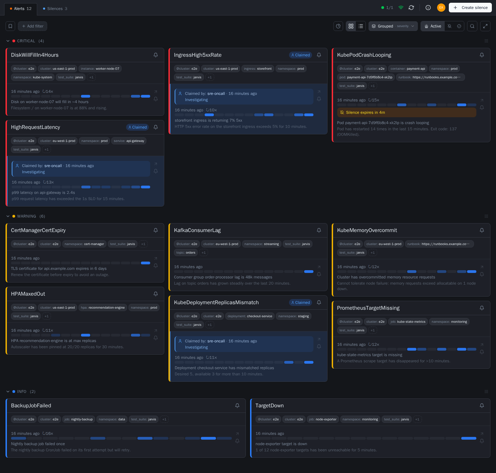

<p align="center">
  
</p>

<h1 align="center">Jarvis</h1>

<p align="center"><i>Interactive, realtime, self-hosted Alertmanager UI</i></p>

<p align="center">
  <a href="https://kj187.github.io/jarvis/"></a>
  <a href="LICENSE"></a>
  <a href="https://github.com/kj187/jarvis/releases/latest"></a>
  <a href="https://github.com/kj187/jarvis/actions/workflows/ci.yml"></a>
  <a href="https://scorecard.dev/viewer/?uri=github.com/kj187/jarvis"></a>
  <a href="https://www.bestpractices.dev/projects/13469"></a>
  <a href="https://codecov.io/gh/kj187/jarvis"></a>
</p>

**Jarvis** is an open source web frontend for Prometheus Alertmanager — interactive, realtime, and self-hosted.

It was inspired by [Karma](https://github.com/prymitive/karma), which is a great project. However, I was missing features that matter for day-to-day on-call work: full persistence across restarts, the ability to comment on individual alerts, a claiming system so the team knows who is handling what, and a solid foundation to build further operational tooling on top of. Jarvis is the result.

<picture>
  <source media="(prefers-color-scheme: dark)" srcset="docs/assets/screenshot.png">
  <source media="(prefers-color-scheme: light)" srcset="docs/assets/screenshot-light.png">
  
</picture>

<p align="center">
  <a href="https://www.youtube.com/watch?v=gssfmws8B6o"></a>
</p>

<p align="center"><i>Two and a half minutes through Jarvis: every cluster live, the full alert history, claims and comments, and silences with a preview.</i></p>

## Why Jarvis?

Most Alertmanager UIs are read-only dashboards. Jarvis is built for teams that need to *act* on alerts, not just observe them:

- **Realtime alerts** via WebSocket — no page reload required
- **Persistent history** — full alert lifecycle stored in SQLite or PostgreSQL, with a grace period that prevents ghost-resolve noise on a missed poll
- **Claiming & comments** — assign an alert to yourself, leave fingerprint-bound notes that survive restarts and re-fires
- **Multi-cluster & Alertmanager HA** — every cluster live in one view; point one cluster at an HA gossip group and alerts are deduplicated by fingerprint
- **Silences with confidence** — live preview of exactly what a silence will hit before you create it, one-click Fast-Silence, reusable templates
- **Saved filters** — Alertmanager matcher chips, shareable via URL, one marked as your default
- **Per-cluster upstream auth** — OAuth2 client credentials (auto-refresh), bearer token, basic auth or custom headers, for a protected Alertmanager
- **Single binary** — one container; SQLite needs no external service, switch to PostgreSQL to run several replicas; a Helm chart is included
- **User authentication** — optional UI login: built-in accounts with an admin panel, or any OIDC provider

Worried about feature creep? Jarvis has a deliberately focused scope — what it is and what it will never become is written down in **[Scope](https://kj187.github.io/jarvis/concepts/scope)**. The full feature list, with screenshots, is in **[Features](https://kj187.github.io/jarvis/reference/features)**. The full documentation — getting started, deployment, configuration reference, concepts — is at **[kj187.github.io/jarvis](https://kj187.github.io/jarvis/)**.

### Built with AI

AI writes the code; 20 years of software engineering experience — 9 of them in DevOps/platform engineering — directs it, so this isn't vibe-coded. Every commit and CI run enforces the same bar as hand-written code: gosec, govulncheck, golangci-lint, pnpm audit, plus defense-in-depth hardening (strict CSP, read-only container filesystem, no-new-privileges). See [Security Policy](https://kj187.github.io/jarvis/project/security-policy) for details.

## Getting Started

**No clone needed — runs entirely from the published image.**

All you need is Podman or Docker, and **a reachable Alertmanager** — the
snippet below does not start one. Replace `http://alertmanager:9093` with your
own instance; if it runs outside this compose network, use its real address.

Just looking around? [the demo guide](https://kj187.github.io/jarvis/demo) brings up Jarvis
*and* a throwaway Alertmanager filled with realistic alerts in five minutes.

```yaml
services:
  jarvis:
    image: ghcr.io/kj187/jarvis:1.12.0
    ports:
      - "8080:8080"
    volumes:
      - jarvis_data:/data
    read_only: true
    tmpfs:
      - /tmp
    security_opt:
      - no-new-privileges:true
    cap_drop:
      - ALL
    environment:
      JARVIS_CLUSTER_1_NAME: dev
      JARVIS_CLUSTER_1_ALERTMANAGER_URL: http://alertmanager:9093
    restart: unless-stopped

volumes:
  jarvis_data:
```

```bash
podman compose up -d
```

Now open <http://localhost:8080>. Kubernetes/Helm, signature verification and
upgrade notes are in **[Kubernetes deployment](https://kj187.github.io/jarvis/deploy/kubernetes)**
and **[Upgrading](https://kj187.github.io/jarvis/howto/upgrade)**; every environment variable is
listed in **[Configuration reference](https://kj187.github.io/jarvis/reference/configuration)**.

## Compatibility

Jarvis uses the Alertmanager HTTP API v2 exclusively — introduced in
Alertmanager 0.16.0. See **[Compatibility](https://kj187.github.io/jarvis/reference/compatibility)**
for the tested versions.

## Contributing

Contributions are welcome! Please read our [Contributing Guide](https://kj187.github.io/jarvis/project/contributing) for details on the development workflow, pull request process, and coding standards.

## License

Apache 2.0 — see [LICENSE](LICENSE)
