# Architecture — who talks to whom, and when

The one picture to keep in mind: **only the backend talks to Alertmanager on
a schedule; browsers only ever talk to Jarvis.** Client count never
influences Alertmanager load.



## The three traffic patterns

**1. Recorder poll (every `JARVIS_POLL_INTERVAL`, default 15s)**
The recorder fetches alerts and silences from every configured Alertmanager
member in parallel, merges HA members (union by fingerprint/ID), and then:

- replaces the in-memory **AlertStore** and **SilenceStore** snapshots
- records each member's up/down state (the **member up-state cache**)
- persists alert lifecycle events (firing → suppressed → resolved …) to the
  database
- broadcasts `alerts_update` / `silences_update` over WebSocket when the
  snapshot actually changed

This is the **only** recurring Alertmanager traffic: `(alerts + silences)`
per member per poll interval, flat regardless of how many tabs are open.

**2. Client reads (page load + refetch)**
`GET /api/v1/alerts`, `/silences`, and `/clusters` are served entirely from
the in-memory snapshots and the cached up-state — zero Alertmanager calls
per request. History, claims, and comments come from the database.

**3. Client writes (user actions)**
Silence create/delete is the only user action that reaches Alertmanager
(sent to the first healthy member, one retry). On success the backend
writes the change through into the SilenceStore, broadcasts
`silences_update` to all other sessions, and triggers an immediate poll so
the authoritative Alertmanager state reconciles the snapshot within one
cycle. Claims and comments are Jarvis-internal (database only).

## Freshness guarantees

| Change | Visible in the UI |
|---|---|
| Own silence create/edit/delete | immediately (write-through + refetch) |
| Someone else's silence change via Jarvis | near-instant (`silences_update` push) |
| Silence created/expired directly in Alertmanager | ≤ one poll interval |
| Alertmanager member goes down/up | ≤ one poll interval (health badge) |
| Alert state changes | ≤ one poll interval (`alerts_update` push) |

## Regenerating the diagram

The Mermaid source lives in [`docs/diagrams/`](diagrams/); rendering runs in
a container (no local tooling needed):

```bash
make diagrams   # renders docs/diagrams/*.mmd → docs/assets/*.svg
```

For the full engineering reference (data model, endpoints, component tree,
state machine) see [`.agents/architecture.md`](../.agents/architecture.md).
