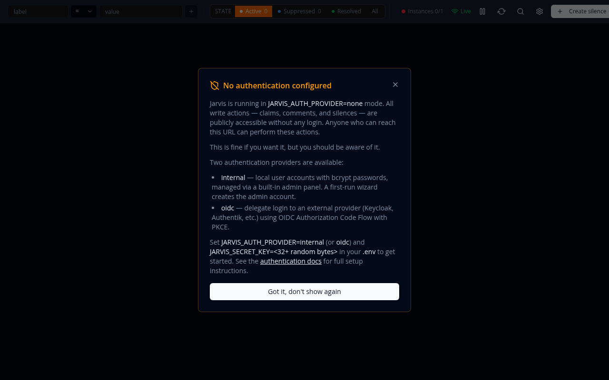
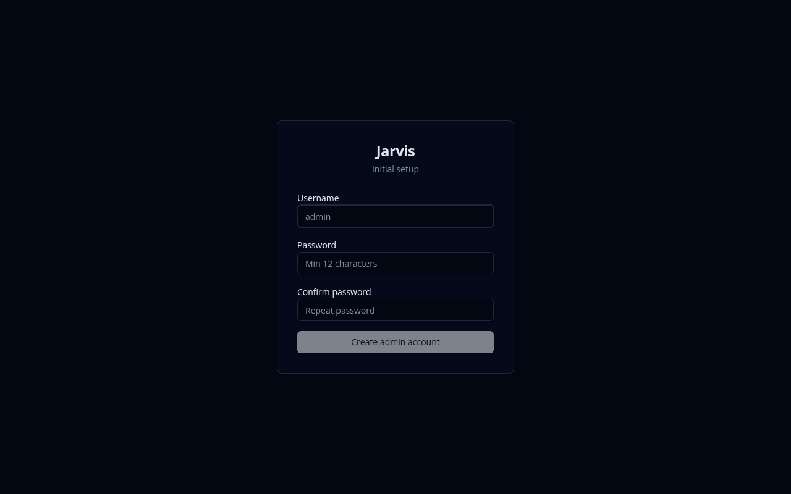
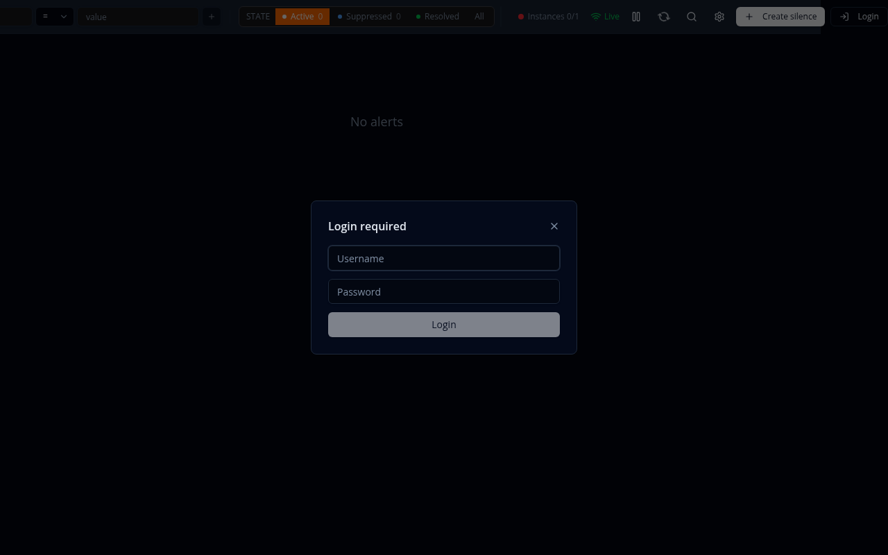
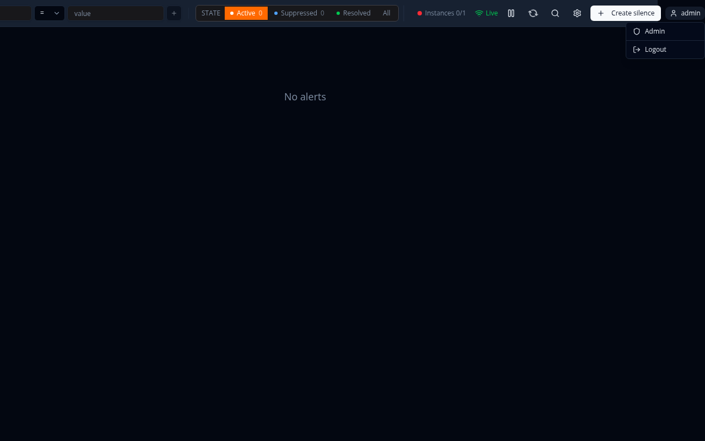
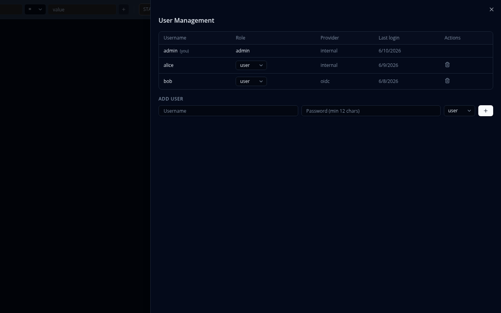
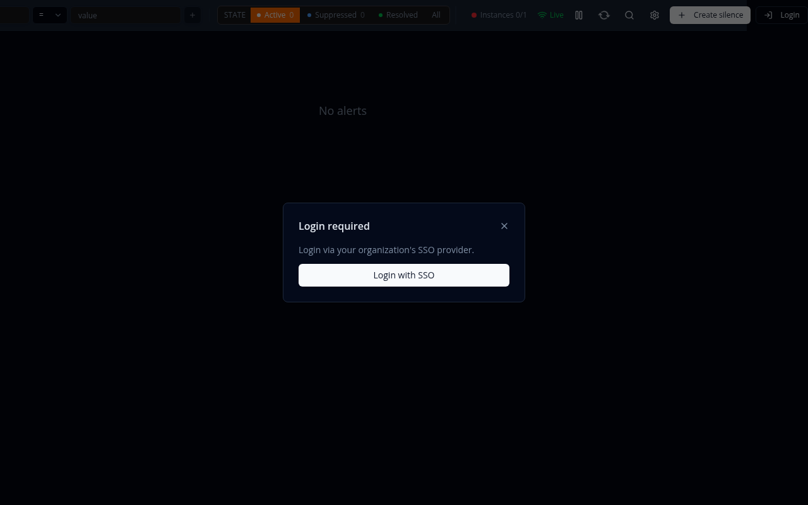

# Authentication

Jarvis supports three authentication modes, controlled by the `JARVIS_AUTH_PROVIDER` environment variable.

| Mode | Description |
|------|-------------|
| `none` | No login required. All write actions are publicly accessible. Default. |
| `internal` | Local user accounts with bcrypt passwords. A first-run wizard creates the admin account. |
| `oidc` | Delegate login to an external OIDC provider (Keycloak, Authentik, Dex, etc.). |

---

## Quick Start

### No authentication (default)

```env
JARVIS_AUTH_PROVIDER=none
```

Anyone who can reach Jarvis can read alerts and perform write actions (claims, comments, silences). Suitable for private networks with no external access.

On first load, Jarvis shows a one-time notice explaining that authentication is not configured:



### Internal accounts

```env
JARVIS_AUTH_PROVIDER=internal
JARVIS_SECRET_KEY=<min 32 random bytes>
```

On first access, Jarvis redirects to `/setup` where you create the initial admin account. Additional users are managed via the admin panel at `/admin/users`.

Generate a secret key:

```bash
openssl rand -hex 32
```

### OIDC (Keycloak, Authentik, etc.)

```env
JARVIS_AUTH_PROVIDER=oidc
JARVIS_SECRET_KEY=<min 32 random bytes>
JARVIS_AUTH_OIDC_ISSUER=https://keycloak.example.com/realms/myrealm
JARVIS_AUTH_OIDC_CLIENT_ID=jarvis
JARVIS_AUTH_OIDC_CLIENT_SECRET=<client-secret>
JARVIS_AUTH_OIDC_REDIRECT_URL=https://jarvis.example.com/auth/oidc/callback
JARVIS_AUTH_OIDC_SCOPES=openid,profile,email
```

---

## Environment Variables

| Variable | Required | Default | Description |
|----------|----------|---------|-------------|
| `JARVIS_AUTH_PROVIDER` | no | `none` | Authentication mode: `none`, `internal`, or `oidc` |
| `JARVIS_SECRET_KEY` | for `internal`/`oidc` | — | Key for signing JWT session tokens. Min 32 bytes (hex or base64). Never logged. |
| `JARVIS_AUTH_OIDC_ISSUER` | for `oidc` | — | OIDC provider issuer URL |
| `JARVIS_AUTH_OIDC_CLIENT_ID` | for `oidc` | — | OIDC client ID |
| `JARVIS_AUTH_OIDC_CLIENT_SECRET` | for `oidc` | — | OIDC client secret |
| `JARVIS_AUTH_OIDC_REDIRECT_URL` | for `oidc` | — | Callback URL (must match provider config) |
| `JARVIS_AUTH_OIDC_SCOPES` | no | `openid,profile,email` | Comma-separated OIDC scopes |

---

## Internal Provider — First-Run Wizard

When `JARVIS_AUTH_PROVIDER=internal` and no admin account exists in the database, Jarvis redirects every request to `/setup`.

1. Open Jarvis in the browser — you land on the setup page automatically.
2. Enter a username and password (min 12 characters).
3. Submit — the admin account is created and you are redirected to the main view.

The setup endpoint is disabled once at least one user exists in the database.



After setup, users log in via the login modal (triggered by the **Login** button in the header):



### Admin Panel

Admins can manage users at `/admin/users`:

- Create new users (role: `user` or `admin`)
- Reset passwords
- Delete users

The admin panel is only accessible to users with the `admin` role. Open it from the user menu in the header (top right corner).





---

## OIDC Provider

Jarvis uses the **Authorization Code Flow with PKCE**. No client-side secrets are exposed to the browser.

Users are redirected to the OIDC provider on login. The login modal shows a single **Login with SSO** button:



### Flow

```
Browser → GET /auth/oidc/login
        ← redirect to OIDC provider (with code_challenge)
Browser → authenticate at provider
        ← redirect to /auth/oidc/callback?code=...
Backend → exchange code for tokens (verifies code_verifier)
        ← Set-Cookie: jarvis_session (HttpOnly, SameSite=Lax)
Browser → redirect to /
```

### Keycloak Setup

1. Create a new client in your realm with:
   - **Client ID**: `jarvis`
   - **Client authentication**: on (confidential client)
   - **Valid redirect URIs**: `https://jarvis.example.com/auth/oidc/callback`
2. Copy the client secret from the **Credentials** tab.
3. Set `JARVIS_AUTH_OIDC_ISSUER=https://keycloak.example.com/realms/<realm>`.

### Authentik Setup

1. Create an **OAuth2/OpenID Provider** with:
   - **Authorization flow**: default (implicit or explicit)
   - **Redirect URIs**: `https://jarvis.example.com/auth/oidc/callback`
2. Create an **Application** linked to that provider.
3. Set `JARVIS_AUTH_OIDC_ISSUER=https://authentik.example.com/application/o/<slug>/`.

### Role Mapping

OIDC users are assigned the `user` role by default. To grant admin rights, an admin must promote the user via the admin panel after first login.

---

## Sessions

Sessions are stored as signed JWT cookies:

| Property | Value |
|----------|-------|
| Cookie name | `jarvis_session` |
| TTL | 24 hours |
| HttpOnly | yes (not accessible via JavaScript) |
| SameSite | Lax |
| Secure | yes when served over HTTPS (detected via `X-Forwarded-Proto`) |

---

## Roles

| Role | Capabilities |
|------|-------------|
| `user` | Read alerts, create/delete own claims and comments, create silences |
| `admin` | All `user` capabilities + manage users via `/admin/users` |

---

## Kubernetes / Helm

```yaml
auth:
  provider: internal    # none | internal | oidc
  secretKey: ""         # use existingSecret in production
  existingSecret: ""    # K8s Secret containing secret-key (and oidc-client-secret)
  existingSecretKeys:
    secretKey: secret-key
    oidcClientSecret: oidc-client-secret
  oidc:
    issuer: ""
    clientId: ""
    clientSecret: ""    # stored in the auth Secret
    redirectUrl: ""
    scopes: "openid,profile,email"
```

### Internal auth with chart-managed secret

```yaml
auth:
  provider: internal
  secretKey: "$(openssl rand -hex 32)"
```

### Internal auth with external secret

```bash
kubectl create secret generic jarvis-auth \
  --from-literal=secret-key=$(openssl rand -hex 32)
```

```yaml
auth:
  provider: internal
  existingSecret: jarvis-auth
```

### OIDC with external secret

```bash
kubectl create secret generic jarvis-auth \
  --from-literal=secret-key=$(openssl rand -hex 32) \
  --from-literal=oidc-client-secret=<your-client-secret>
```

```yaml
auth:
  provider: oidc
  existingSecret: jarvis-auth
  oidc:
    issuer: https://keycloak.example.com/realms/myrealm
    clientId: jarvis
    redirectUrl: https://jarvis.example.com/auth/oidc/callback
```

For a full values reference see [charts/jarvis/README.md](../charts/jarvis/README.md).

---

## Security Notes

- `JARVIS_SECRET_KEY` is never written to logs. Use at least 32 random bytes.
- OIDC client secret is stored in a Kubernetes Secret, not in the ConfigMap.
- The `/setup` endpoint is automatically disabled once any user account exists.
- All cookies are `HttpOnly` — the session token is not readable by JavaScript.
- `SameSite=Lax` prevents CSRF on cross-site form submissions.
- The admin panel (`/admin/users`) requires the `admin` role and is protected by `RequireAdmin` middleware.

For a full security discussion see [SECURITY.md](SECURITY.md).
