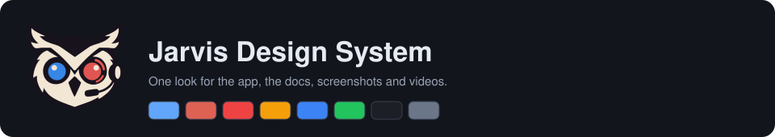
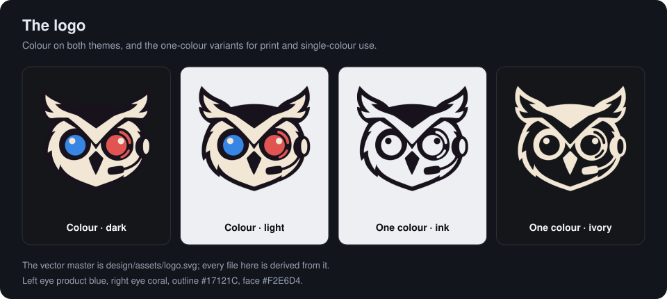
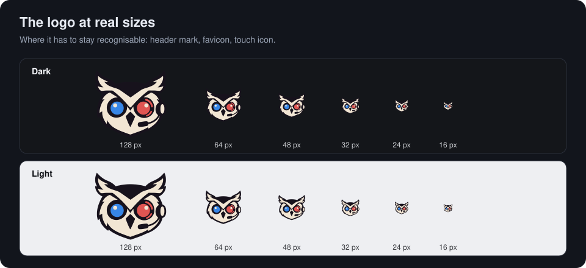
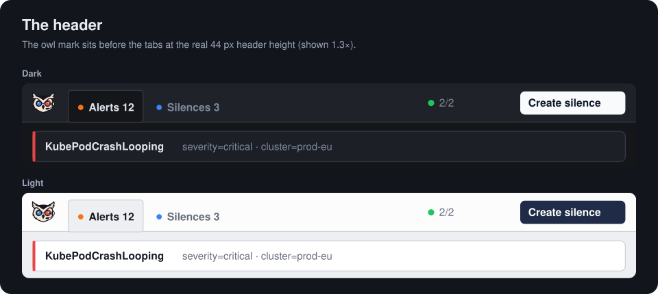
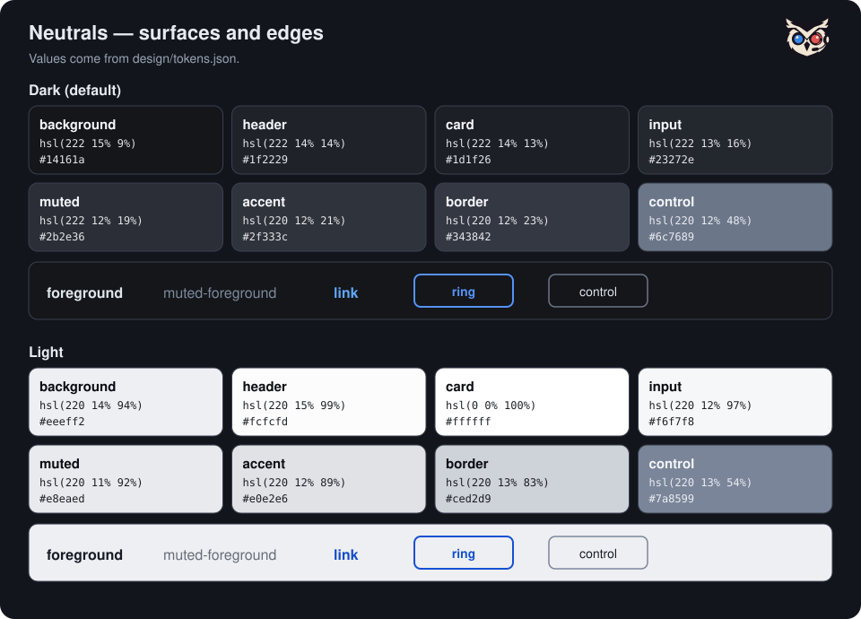
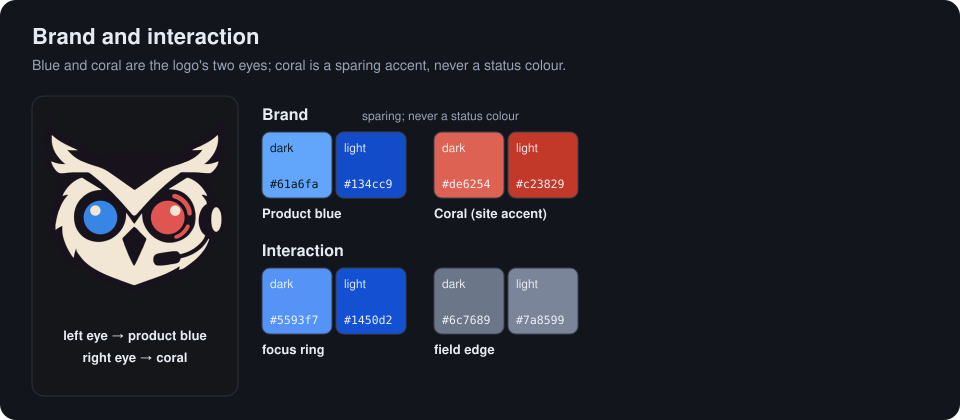
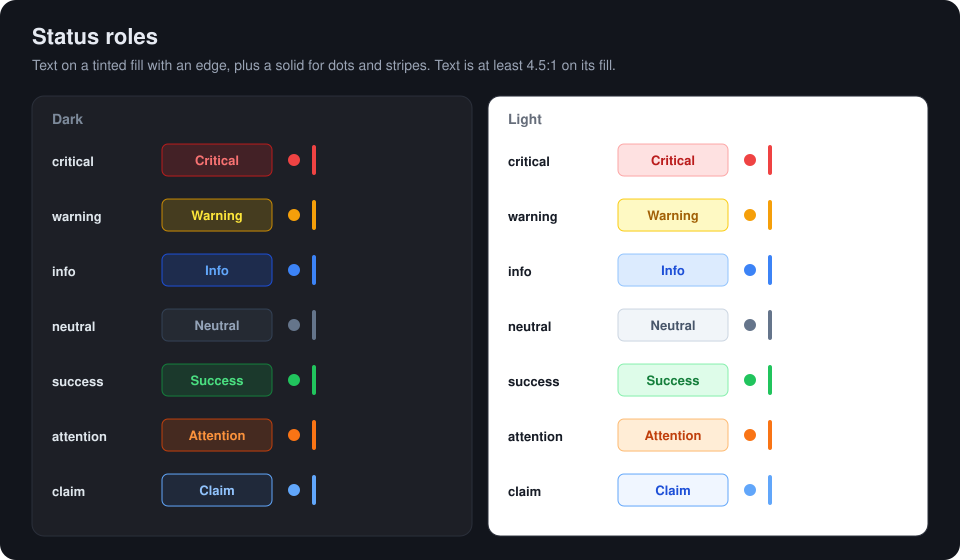
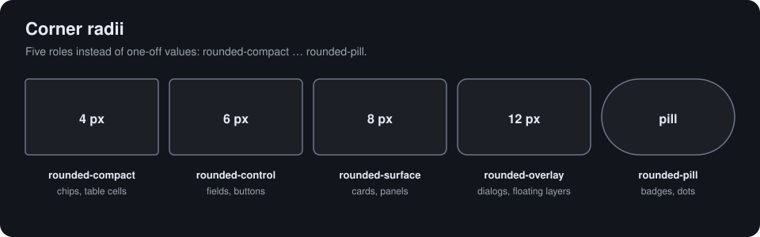
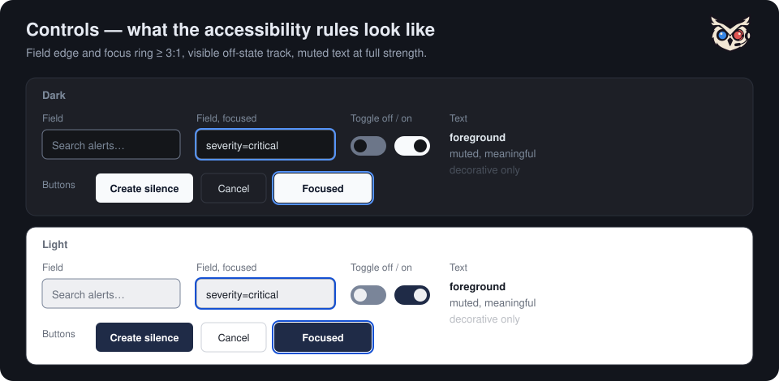
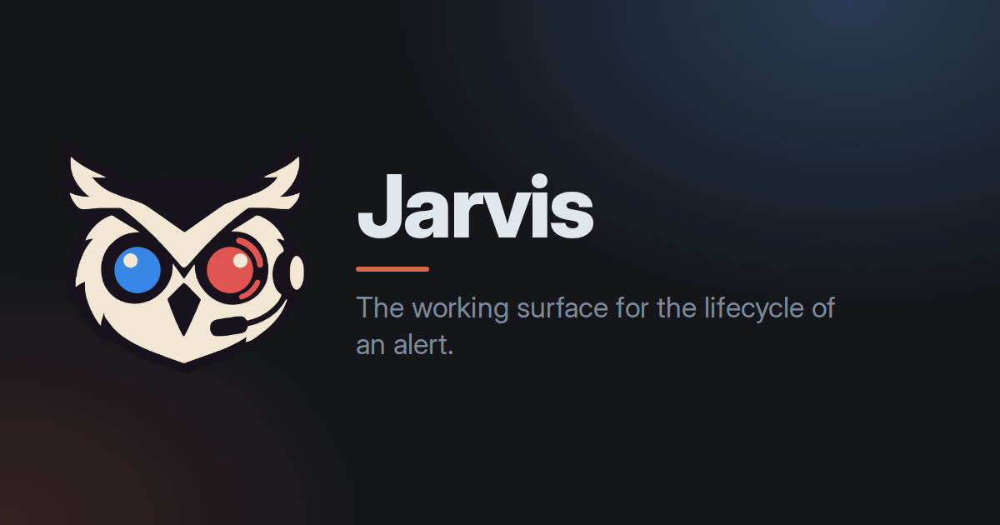

# Design System

How Jarvis looks and behaves — one place for the rules that keep the app, the
documentation site, the screenshots and the release videos recognisably the
same product. It is written for contributors and for AI coding agents.

**Binding levels.** **MUST** is required — a change that breaks it is not
merged. **SHOULD** is the default; deviate only with a reason in the PR.
**MAY** is optional. Most MUST rules are enforced by a test or a check; the
last section lists them.

## Principles

Jarvis is the cockpit you open when an alert comes in and you need to act. The
design serves that moment.

- **Operational clarity — MUST.** The state of an alert (firing, suppressed,
  resolved, claimed) is readable at a glance and never carried by colour alone.
- **Density over decoration — SHOULD.** Show more alerts, not more chrome. The
  product UI stays compact; the documentation site and media may be more
  spacious.
- **Calm under pressure — SHOULD.** Motion explains a change; it never
  decorates and never loops for its own sake.
- **One meaning, one look — MUST.** The same fact looks the same everywhere: one
  colour, one shape, one component per meaning.
- **Open and inspectable — SHOULD.** Fonts are local and licensed; no external
  font or icon CDNs (the strict CSP depends on it).

## Logo

The mark is an owl wearing a headset: a dark outline, a warm ivory face, a
**blue left eye** and a **coral right eye**. The two eyes are the two brand
colours.

The vector master is [`design/assets/logo.svg`](https://github.com/kj187/jarvis/blob/main/design/assets/logo.svg)
(outline `#17121C`, face `#F2E6D4`, left eye `#3786E6`, right eye `#E05552`).
Everything else is derived from it by `scripts/logo-assets.py`: `logo.png`
(1024 px, transparent), the 16 and 32 px favicons, `favicon.ico`, the touch
icon and the two one-colour variants — ink for light backgrounds, ivory for
dark ones.

- **MUST** use the canonical files. Never resize, recolour, stretch, rotate or
  add effects to the mark; derive a new size from the master.
- **MUST** stay recognisable at the target size — down to 16 px both eyes and
  the ear tufts still read.
- **SHOULD** keep clear space of at least one eighth of the mark's width on
  every side, and use the mark alone (no wordmark) in the app and in favicons.
- **SHOULD** use the one-colour variants only where colour is not available
  (print, embossing, single-colour merchandise).
- On the dark app background the dark outline merges with the surface; the eyes
  and the ivory face carry the silhouette. If a screenshot review shows the
  shape is lost at some size, add a light keyline variant rather than changing
  the mark.

**The header mark.** A 28 px owl mark sits permanently at the left of the
header, before the navigation tabs, so the product is identifiable at a glance.
It is decorative (`alt=""`, `aria-hidden`) and not a link, so it adds no
accessible name next to the navigation buttons.

## Colour

Colour has four layers. Keep them separate.

| Layer | Purpose | Members |
|---|---|---|
| Neutral | Surfaces and text | background, card, header, popover, input, muted, accent, border, foreground |
| Brand | Identity, used sparingly | product blue, coral |
| Status | Alert and system meaning | critical, warning, info, neutral, success, attention, claim |
| Interaction | State of a control | link, focus ring, field edge, selected |

### One source of values

Every colour and radius value lives in
[`design/tokens.json`](https://github.com/kj187/jarvis/blob/main/design/tokens.json).
`node scripts/design-tokens.mjs` generates from it the app's Tailwind theme
(`frontend/src/generated/tokens.css`), the documentation site's variables
(`website/.vitepress/theme/generated-tokens.css`) and the hex constants of the
video cards (`frontend/e2e/video/generated-theme.ts`). Never edit a generated
file; the pre-commit hook and CI run the script with `--check`.

Components use the semantic Tailwind utilities — `bg-card`,
`text-muted-foreground`, `border-control`, `bg-critical-soft`. They **MUST NOT**
use a raw palette class (`text-red-400`), a hex or an `rgb()` literal.
`dark:` follows the app's own theme (`data-theme`), not the operating system.

### Neutrals

Surface depth in dark runs background 9 % → card/header 13–14 % → input 16 % →
muted 19 % → accent 21 % → border 23 %. The header is deliberately lifted
further than that step so the toolbar reads as its own surface. Saturation
stays at 12–15 % to avoid an "electric navy" look. Light mirrors the chain:
background 94 %, header 99 %, card 100 %.

### Brand

- **Product blue** is the colour of links, focus and selection — the product's
  interaction colour and the logo's left eye.
- **Coral** (the logo's right eye) is a brand accent for the documentation site
  and media. **SHOULD** stay sparing: a tagline, an underline, a cover.
  **MUST NOT** stand in for a status colour — coral is not "critical".

### Status roles

Each role is text (`-fg`) on a tinted fill (`-soft`) with an edge (`-edge`),
plus a solid (`-solid`) for dots and stripes. The same role means the same thing
in every component and in both themes.

| Role | Means |
|---|---|
| `critical` | Critical severity, firing alert, down instance, offline |
| `warning` | Warning severity, expiring silence, modified filter, hints |
| `info` | Info severity, the Silences tab |
| `neutral` | No severity, suppressed, pending silence |
| `success` | Resolved, healthy instance, active silence |
| `attention` | Unprocessed alert, error severity, the Alerts tab |
| `claim` | Someone is handling this alert |

`selected` is the fill of a selected row. A new state gets its own role — blue
must not pick up another meaning.

- **MUST** carry state in text or shape as well: badges say "Critical",
  "Warning", "Info"; the stripe on a card is a redundant cue, not the only one.
- **MUST NOT** branch on the theme in a component to choose a colour; the token
  already differs per theme.

### Contrast

Target is **WCAG 2.2 AA**: 4.5 : 1 for normal text, 3 : 1 for large text, UI
boundaries and state indicators. Measured from the tokens:

| Pair | Dark | Light |
|---|---|---|
| `foreground` on `background` | 14.4 : 1 | 14.9 : 1 |
| `muted-foreground` on `background` | 6.8 : 1 | 5.2 : 1 |
| `muted-foreground` on `card` | 6.1 : 1 | 6.0 : 1 |
| `muted-foreground` on `input`, `muted`, `accent` | ≥ 4.5 : 1 | ≥ 4.5 : 1 |
| `link` on `background` | 7.2 : 1 | 6.3 : 1 |
| `ring` on `background` / `card` | 6.0 / 5.4 : 1 | 5.9 / 6.8 : 1 |
| `control` on `background` / `card` | 3.9 / 3.6 : 1 | 3.2 / 3.7 : 1 |
| any role's `-fg` on its `-soft` | ≥ 4.5 : 1 | ≥ 4.5 : 1 |

- **MUST** keep `muted-foreground` at full strength for text that carries
  meaning. It reaches 4.5 : 1 on every surface it sits on, including inputs, chips
  and hover fills; stacking `/60` or `/70` opacity on top drops it below AA. Opacity is for decoration only (separators, placeholders,
  hover-revealed affordances, disabled states).
- **MUST** give the edge of a text field or select at least 3 : 1 — use
  `border-control`. Cards, header and tables keep the quiet `border`, because
  there the edge is not what identifies the element.
- **MUST** give icon-only controls (pin, drag handle, info hint) and the off
  state of a toggle at least 3 : 1. A button with a visible text label does not
  need a high-contrast edge; the label identifies it.
- `frontend/src/lib/themeTokens.test.ts` asserts the focus ring, the field edge,
  `muted-foreground` on every surface and every role's text contrast in both
  themes. Add new token pairs there.

Semi-transparent combinations outside the tokens (`bg-foreground/95`) are not
covered by that test; measure them in the browser on the rendered result.

## Typography

- **Inter** is the face of everything in the product UI and of the
  documentation site's body text. The app bundles it (`public/fonts/`, a Latin
  subset of the official variable font, 100 KB, SIL OFL with its licence beside
  it) and preloads it; the docs site gets it from the VitePress default theme.
  No font CDN.
- **Sora** (self-hosted, SIL OFL) is the documentation site's display face —
  hero and feature titles only. **MUST NOT** be used for body copy or UI chrome.
- **Monospace** is for label matchers, code, IDs and versions only, from a fixed
  stack (`ui-monospace, 'SF Mono', Menlo, Consolas, 'Liberation Mono'`), so
  screenshots do not depend on one platform.
- **Size roles.** The product is compact; sizes are roles, not one-off values.

| Role | Size | Use |
|---|---|---|
| caption | 10–11 px | Redundant metadata only (counts, secondary time) |
| meta | 11–12 px | Secondary lines, chips, table cells |
| body-compact | 12–14 px | Default product text |
| body | 14–16 px | Detail panel prose, documentation |
| title | 16–20 px | Panel and page headings |
| display | 28 px and up | Documentation hero |

  **SHOULD** use 10 px only for information that is repeated elsewhere. Do not
  invent sizes such as `text-[10.5px]`; take the nearest role.

## Spacing, shape and depth

- **MUST** build on the 4 px grid (Tailwind's scale). The product is
  **compact** (rows around 28–36 px); the documentation site and media are
  **comfortable**. State which one a new surface belongs to.
- **Corner radii are roles**, not values:

  Use `rounded-compact|control|surface|overlay|pill`; a raw `rounded-md` is
  rejected by the drift check.
- **SHOULD** use shadows only to show a change of layer (`shadow-sm` on cards,
  a larger shadow on overlays). No glows in the product UI; media may use a
  stronger shadow for depth.

## Icons and illustration

- **MUST** use Lucide with the default 2 px outline for product UI. Do not mix
  in another icon set or filled icons.
- **MUST** give every icon-only control an accessible name (`aria-label`).
- The owl logo and the owl mesh are the brand illustration. The mesh geometry
  is shared between app and website (`frontend/src/lib/owlMesh.ts`, sampled
  from `logo.png`); reuse it, do not redraw it. It **MUST** stop under
  `prefers-reduced-motion`.

## Components and states

Use the primitives in `frontend/src/components/ui/`: `Button`, `Input`,
`Select`, `Textarea`, `DateTimePicker`, `Card`, `Badge`, `Avatar`, `Tooltip`,
`InfoHint`, `Popover`, `Dialog`, `Sheet`. **MUST** reuse a primitive before
writing a new control, and cover every state a control can be in: default,
hover, focus, active, disabled, loading and error.

Every clickable element **MUST** show `cursor: pointer` (set globally in
`index.css`), and every view **MUST** handle loading and error.

### Overlays — one primitive per role

| Role | Primitive | Behaviour |
|---|---|---|
| Modal dialog | `Dialog` | Blocks the page. Accessible name, focus moves in, Tab is trapped, Escape closes, focus returns to the opener. |
| Side sheet | `Sheet` | Same focus contract as `Dialog`, slides in from the edge. |
| Popover / menu | `Popover` | Non-modal, may hold interactive content. Opens on hover **and** Enter/Space; Escape closes and returns focus to the trigger; focus leaving closes it; the trigger exposes `aria-expanded` and `aria-controls`. Used by the header's cluster status, refresh hint, About and user menu. |
| Hint | `InfoHint` | An "(i)" button with an explanation: focusable, `aria-describedby`, Escape closes the hint without closing a surrounding sheet. |
| Tooltip | `Tooltip` | Short, non-interactive text on hover and focus. **MUST NOT** contain links or buttons. |

**MUST NOT** make hover the only way to reach something. Anything that opens on
hover also opens on keyboard focus or activation, closes with Escape, and
exposes its state to assistive technology.

## Themes

- Dark is the default; light is a full peer, not an inversion. A meaning has the
  same role in both themes; only the value changes.
- **MUST** check every visual change in both themes and measure contrast per
  theme.
- **MUST NOT** branch on the theme in a component to pick a colour; use a token.

## Motion

- Motion explains a change (a new alert, a state transition); it does not
  decorate.
- Under `prefers-reduced-motion: reduce`, transitions are effectively off and
  decorative loops (ping, pulse, bounce, the claim spinner) stop. Loading
  spinners keep turning, because they are the only progress signal there. The
  owl mesh stops as well.
- A new animation **MUST** be covered by that rule in the same change.

## Accessibility

Baseline **WCAG 2.2 AA**.

- Everything is reachable and operable from the keyboard, in a logical order.
- Focus is shown by a 2 px blue ring (`focus-visible:ring-2`) that keeps at
  least 3 : 1 against every surface in both themes. Do not remove it with
  `outline-none` without providing the ring.
- Status is never colour alone (see Status roles). The live connection says
  "Offline" in words, not only by a red icon.
- Interactive targets are at least 24 px; 44 px is the goal on touch.
- The layout survives 200 % zoom at a 1280 px viewport.

Automated: the token contrast test, an axe scan of the Alerts and Silences pages in both themes,
the reduced-motion rule, and the keyboard end-to-end flows for dialogs, the header popovers and
info hints. Not automatable and done by hand:
a screen-reader pass (VoiceOver or NVDA) over navigation, filters, the detail
panel and the silence dialog.

## Documentation site

The site shares its palette with the app through the generated tokens, but is a
separate implementation (`website/.vitepress/theme/`).

- `--vp-c-text-3` is decorative and large-text only (about 3.1 : 1 light,
  3.6 : 1 dark); labels and body copy we style ourselves use `--vp-c-text-2`.
  Coral text in light mode stays at 4.5 : 1 or better.
- The landing page carries the brand. Reading pages get light touches only:
  rounded tables, code and callouts, a blue accent on tip and info callouts,
  and a 2 px blue keyboard focus ring.

## Screenshots, video and social images

- **Screenshots** come from the fixture stack (see
  [E2E & screenshot testing](testing-e2e.md)), never from real data: 1440 × 900
  at device scale 2, dark by default. Only the hero and overview images also
  exist as a dark/light pair, switched by the site theme; detail and step images
  stay single. Regenerate with `make e2e-screenshots` after any visual change.
- **Videos** use the logo palette: product blue with coral as the counterweight
  (`frontend/e2e/video/theme.ts`, built on the generated palette). No video
  files live in the repository.
- **Social and Open Graph images** are generated from the tokens, the bundled
  Inter and the logo by a screenshot spec, so they cannot drift:

  Formats: Open Graph 1200 × 630 (`social-og.png`, the image the docs site
  shares), square 1080 × 1080 and slide 1920 × 1080. Logo left, title right (or
  stacked for the square), a blue glow, one coral accent.
- Every image **MUST** have alt text that says what it shows, not "screenshot".

## Do and don't

| Do | Don't |
|---|---|
| Use `border-control` on a field | Hand-pick `border-gray-500` |
| Use `text-muted-foreground` at full strength for meaningful text | Add `/60` to it |
| Use `bg-warning-soft text-warning-fg` | Use `text-yellow-400`, or branch on the theme |
| Open a popover from a `<button>` with `aria-expanded` | Hang a menu on a hover-only `div` |
| Give a new state its own status role | Give blue another meaning |
| Derive icons and favicons from the master | Resize the PNG by hand |
| Use `rounded-control` | Use `rounded-md` |
| Reuse `owlMesh.ts` | Redraw the mesh |
| Answer reduced motion with any new animation | Add an endless loop |

## Where the rules are enforced

- `design/tokens.json` → `scripts/design-tokens.mjs` — the single source of colour
  and radius values; `--check` runs in the pre-commit hook and in CI.
- `scripts/check-design-drift.mjs` (hook and CI) — no raw palette classes, colour
  literals or radius classes in `frontend/src`; avatar colours and the heatmap
  ramp are the only allow-listed data visualisation.
- `frontend/src/lib/themeTokens.test.ts` — contrast of the focus ring, the field
  edge and every status role, in both themes.
- `frontend/e2e/functional/none/a11y.spec.ts` — axe on the main pages in both
  themes and the reduced-motion rule.
- `frontend/e2e/functional/none/app-shell.spec.ts`, `alerts-overview.spec.ts`
  and `alert-ack.spec.ts` — keyboard behaviour of the header popovers, info
  hints, dialogs and the Fast-Silence menu.
- `scripts/logo-assets.py --check` — the derived logo files match the master.
- `scripts/design-guide-assets.py --check` — the illustrations on this page
  match the tokens and the logo. Both scripts need Pillow.
- `AGENTS.md` — the frontend checklist (pointer cursor, no `console.log`,
  loading and error states, shared utilities) and the `design-system` skill.
