# Jarvis — Features

## Card View

Alerts grouped by your configured label (severity by default), with inline claim and silence actions.

The card view is the default landing page and the primary interface for active alert triage. Each card represents one alert fingerprint and is designed to give you enough context to decide what to do next — without opening a detail panel.

**What each card shows:**
- Severity badge (critical / warning / info) with color coding
- Alert name and the cluster it originates from
- All active labels as chips — clickable to instantly add a label filter
- How long the alert has been firing (e.g. "firing for 2h 14m")
- A 14-day firing sparkline under the timestamp — see [Firing Heatmap](#firing-heatmap)
- Claim banner — shows who has claimed the alert and since when, if anyone has

**Actions available directly on the card:**
- **Silence / Fast-Silence** — a persistent bell icon in a narrow column on the right of each alert entry (and one for the whole group, in the card header) opens a menu with the full silence form and one-click Fast-Silence durations — see [Fast-Silence](#fast-silence)
- **Detail** — click anywhere on the alert entry to slide open the full detail panel; claim and all other actions are available there

Sections are grouped by the label selected in **Settings → Group alerts by label** (default: `severity`). You can collapse/expand each section and reorder sections via drag-and-drop (drag handle on the right). The section order and collapsed state are persisted in localStorage per grouping label.

Within each section, groups are sorted alphabetically by alert name. The view updates in real time via WebSocket: new alerts appear, resolved alerts disappear, and claim/silence state refreshes without any page reload.

In the top-right toolbar of the alerts page, the compact **Grouped** toggle lets you switch grouping on/off in Card View.  
- **On**: section grouping by the configured label  
- **Off**: all alerts shown together without section grouping

---

## List View

Compact table layout with sortable columns — useful when dealing with many alerts at once.

The list view is optimized for situations where you have a lot of alerts and need to scan and sort quickly rather than focus on individual cards. It trades visual weight for density.

Alerts are grouped into sections based on the label selected in **Settings → Group alerts by label** (severity by default). Section headers can be collapsed/expanded, and section order can be changed via drag-and-drop.

Within each section, groups are collapsed by alert name. Expand a group to see individual alert instances.

**Columns:**
- **Alert Name** — sortable; shows alert count per group, common labels, and cluster names
- **State** — firing / suppressed / resolved (hidden when a single state tab is active)
- **Time** — sortable; earliest start time within the group
- **Actions** — silence or expire/extend an existing silence without opening the detail panel
- **Claim** — shows how many alerts in the group have been claimed

**Sorting** is available on the **Alert Name** and **Time** columns — click a header to sort ascending, click again for descending.

Switching between card and list view is instant. The selected view mode is persisted in localStorage so your preference survives page refreshes, and URL parameters can override it for direct links.

---

## Fullscreen

Hide the header and all controls — only the alert list fills the screen. Useful for wall displays or focused incident response.

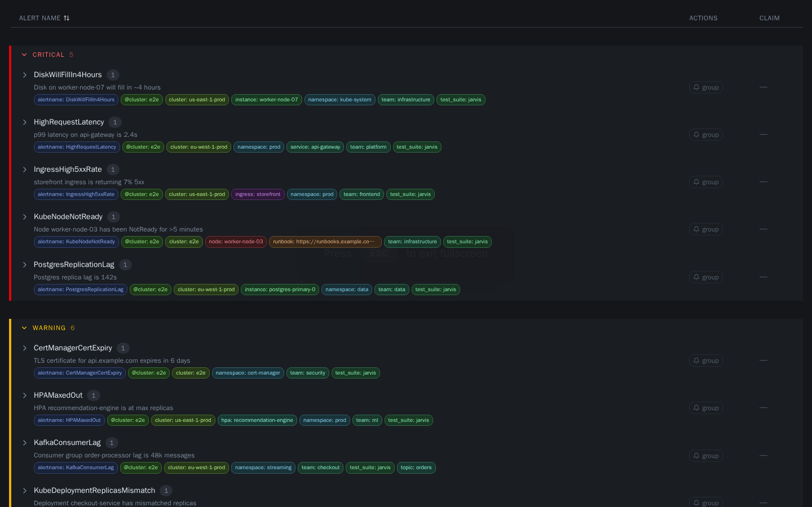

Click the **expand icon** (⛶) in the top-right corner of the filter bar to enter fullscreen. The main header, navigation, and filter controls all disappear, giving the alert list maximum vertical space.

Press **ESC** to exit fullscreen and restore the full interface.

---

## Label Filters

Chip-based label matchers (`=` `!=` `=~` `!~`) that compose into a filter expression and are serialized into the URL for sharing.

Jarvis exposes the full Alertmanager matcher syntax as an interactive chip UI. You do not need to know or type the syntax — you pick a label from the dropdown, choose an operator, and enter a value. The resulting matcher appears as a chip and is applied immediately.

**Supported operators:**
| Operator | Meaning |
|---|---|
| `=` | Exact match |
| `!=` | Negative exact match |
| `=~` | Regex match |
| `!~` | Negative regex match |

**How filters compose:**
- Multiple matchers are ANDed — an alert must match all chips to be shown
- Regex matchers are validated client-side before being applied
- Clicking a label chip on any alert card instantly adds an exact-match filter for that label

**URL serialization:**
The complete filter state is encoded into the URL as query parameters. This means:
- You can bookmark a filtered view and return to it directly (e.g. `?matchers=[{"name":"env","operator":"=","value":"prod"}]`)
- You can copy the URL and share it with a teammate — they land on exactly the same filtered list
- Filters survive page reloads and view mode changes

---

## Alerts Overview

A Karma-style breakdown of the current alert list by label value — the fastest way to answer *"where is the fire?"* when a wall of alerts appears.

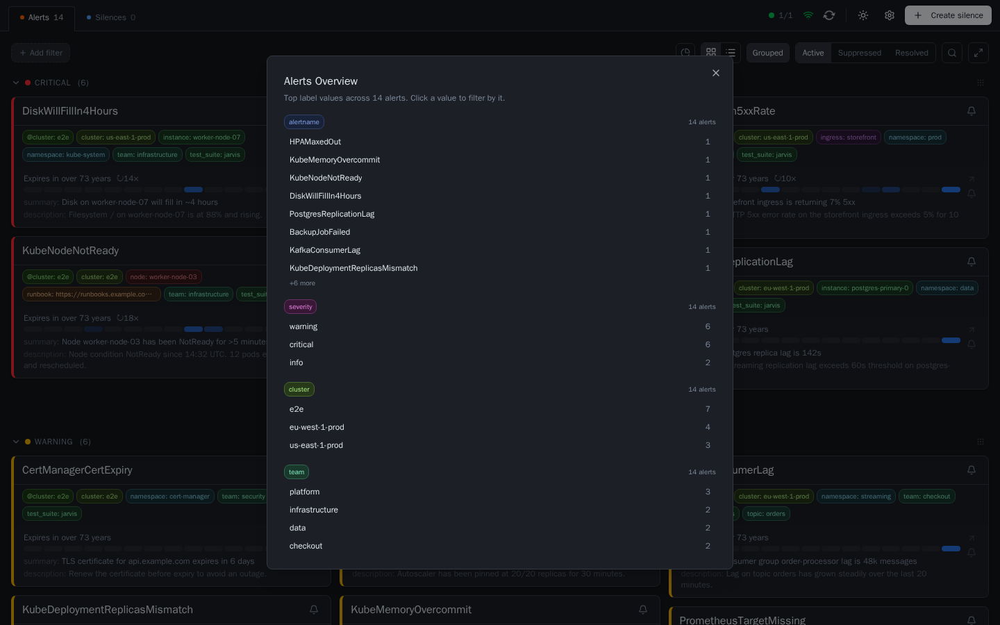

Click the **pie-chart icon** next to the card/list view toggle to open the overview. It aggregates all alerts in the current state tab (Active / Suppressed / Resolved) by label, independent of any label filters already applied — the point is discovering what to filter *by*, not summarizing what's already filtered down.

Labels are ordered by usefulness: `alertname` and `severity` are always pinned to the top, followed by the remaining labels sorted by how many alerts carry them. Each label shows its top 8 values by count, with a "+N more" hint if there are more.

**Click any value** to instantly apply it as a filter chip — the overview closes and the alert list narrows to that value. Clicking a value that's already filtered is a no-op (no duplicate chip).

---

## User Settings

Per-user preferences stored in the browser — no server config required.

Open the Settings panel by clicking the **⚙ gear icon** in the top-right area of the header (next to "Create silence"). Settings are persisted in `localStorage` and apply immediately without a page reload.

### Available settings

| Setting | Description |
|---|---|
| **Time format** | Switch between *Relative* ("6 days ago") and *Absolute* ("Jun 4, 2025, 12:30 PM") timestamps. A live preview updates as you toggle. |
| **Default view** | Choose whether the app starts in *Card* or *List* view on every page load. |
| **Group alerts by label** | Select which label defines top-level sections in Card and List views (`severity` by default, or any label seen in current alerts). |
| **Resolved page size** | Number of resolved alerts shown per page (10 / 25 / 50 / 100). Set via the per-page selector in the resolved view; persisted in localStorage. |
| **Default filter** | Label matchers that are always active — see below. |
| **Default silence duration** | Pre-selected duration when the silence creation form opens (15 min to 3 days). |
| **Creator name** | Pre-fills the "Created by" field in new silences. |

### Default filters — permanent header chips

Default filters appear as **locked chips** in the filter row of the header. They behave like regular label matchers but cannot be removed from the header — they stay active at all times, across page reloads and view changes.

A **lock icon** and dimmed appearance distinguish them from manually added filters. Hovering over a locked chip shows the tooltip: *"Default filter set in Settings — open Settings (⚙) to change or remove."*

To remove or modify a default filter, open Settings → Default Filter → click **×** on the chip, or clear the list and save.

---

## Resolved View

Full alert history persisted in SQLite — survives container restarts and Alertmanager reconnects.

The resolved view is Jarvis's history log. Every alert that has ever fired is recorded in SQLite with its complete lifecycle, and the resolved view shows all alerts that have reached a `resolved` state. This is the core capability that separates Jarvis from in-memory-only UIs.

Alerts are displayed as a flat list sorted by resolution time (newest first). A **page browser** at the top and bottom allows navigation through large result sets. The **per-page selector** (10 / 25 / 50 / 100) is persisted in localStorage so your preference is remembered across sessions.

**What is stored per alert:**
- First seen timestamp (when it first fired, ever)
- Last seen timestamp (most recent firing)
- Full label set at time of firing
- All state transitions: `firing` → `suppressed` → `resolved`, with timestamps
- Occurrence count across all firings
- Comments and claim history

**Why persistence matters:**
- **Post-incident review:** After an incident you can look up exactly when an alert first fired, how long it stayed active, and how many times it re-fired before resolution — without relying on Prometheus or Grafana.
- **Noise analysis:** Recurring alerts with high occurrence counts are easy to identify and prioritize for permanent fixes.
- **Restarts are safe:** The history is not lost when Jarvis restarts, when Alertmanager is down for maintenance, or when the container is updated.
- **Grace period:** If an alert resolves and re-fires within `max(60s, 2 × JARVIS_POLL_INTERVAL)` (e.g. due to a missed poll), Jarvis reopens the existing event instead of creating a phantom new one — keeping the history clean. Full lifecycle semantics: [docs/alert-lifecycle.md](alert-lifecycle.md).

---

## Alert Detail Panel

Per-alert drawer with labels, annotations, firing history, occurrence stats, claim ownership, silence controls, comments, and an AI-analysis prompt — organized into tabs.

The detail panel is the central hub for working with a single alert. It slides in from the right side of the screen without navigating away from the alert list, so you can open it, take action, close it, and move to the next alert without losing context.

**Always visible (above the tabs):**
- Alert name, cluster, severity, and claim chip in the header
- First seen / last seen timestamps and total occurrence count
- Firing heatmap (24h / 7d / 30d range toggle) — see [Firing Heatmap](#firing-heatmap)
- Active/expired silence banners, if the alert is currently or was recently silenced

**The panel is then split into five tabs:**

**Details**

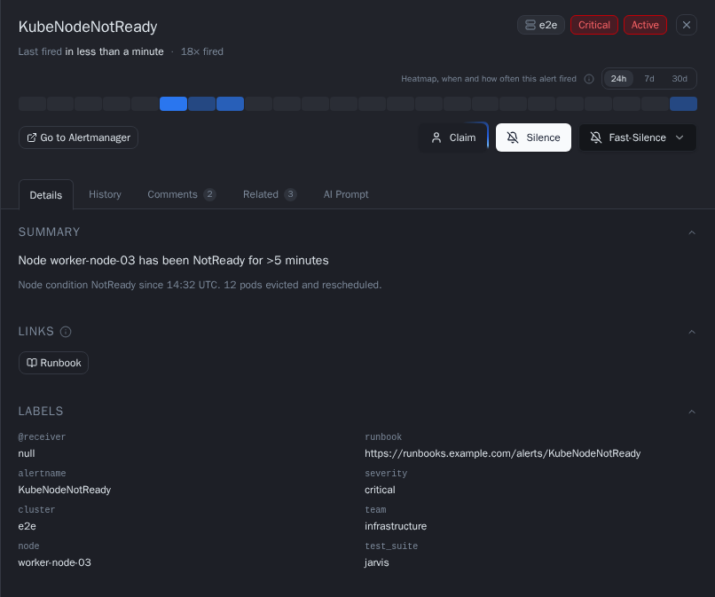

- Complete label set, rendered as key-value pairs
- All annotations, including `description` and `summary`
- **Dynamic link buttons**: any label or annotation whose value is an absolute URL (`http://` or `https://`) automatically renders as a clickable button using the key name as the label — no configuration needed. Examples: `dashboard=https://grafana.example.com/d/abc`, `ticket=https://jira.example.com/ISSUE-1`
- **Runbook**: the `runbook` key (label or annotation) is handled specially:
  - If the value is an absolute URL → used directly as the link
  - If the value is a plain string and `JARVIS_RUNBOOK_BASE_URL` is configured → the final URL is `RUNBOOK_BASE_URL` + value (e.g. `https://wiki.example.com/runbooks/my-alert`)
  - If the value is a plain string and `JARVIS_RUNBOOK_BASE_URL` is not set → no button is shown

**History**

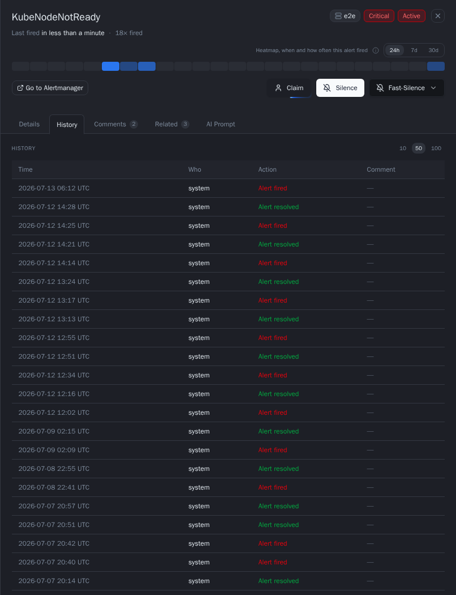

- Full event timeline: every state transition (`firing`, `suppressed`, `resolved`) with exact timestamps
- Merged with claim and silence actions for the same alert, so the whole handling story reads in one place
- Paginated for long-running, frequently-firing alerts

**Comments**

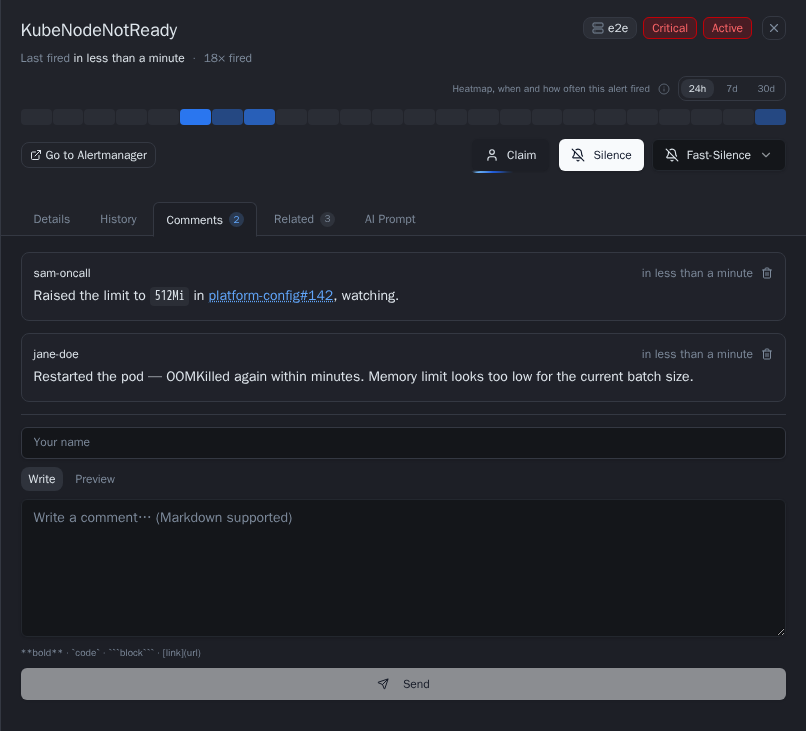

- Write freeform notes bound to the alert's fingerprint — supports Markdown (bold, links, lists, fenced code blocks with syntax highlighting for bash, JSON, YAML, Go, JavaScript, SQL, and INI)
- Comments persist across re-fires: if the alert resolves and fires again later, the comment history is still there
- The tab label carries a count badge, so you can see at a glance whether an alert already has notes without opening the tab
- Useful for documenting investigation steps, linking to tickets, or leaving context for the next person on-call

**Related**

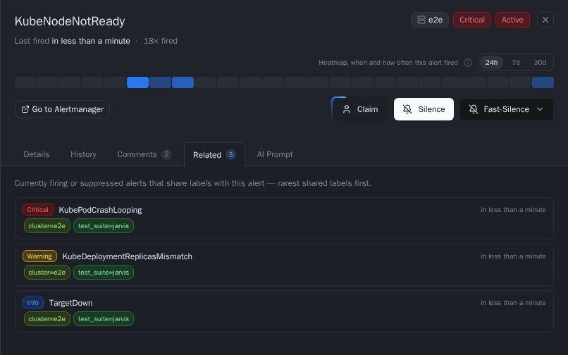

- Answers *"is this alert part of a bigger problem?"* — lists other **currently firing or suppressed** alerts that share labels with the open alert, without leaving the panel
- The tab label carries a count badge, so you can spot a correlated incident before even opening the tab
- Each row shows the severity, alert name, the shared labels as chips (most specific first), the cluster name when the related alert lives in a different cluster, and when it started — click a row to jump to that alert's detail
- Results are ranked, top 10 shown first with a **Show more** button for the rest

*How relatedness is computed:*

- Two alerts are related when they share at least one label with an identical value — any real label counts (`instance`, `namespace`, `pod`, `job`, custom labels like `entity` or `device`, …)
- **Not** counted: `alertname` (fifty hosts firing the same rule is a grouping concern, not a shared blast radius), `severity`, `receiver`, and labels whose value is a URL (runbook/dashboard links are metadata, not identity)
- **Rarity weighting**: a shared label value carried by only two alerts (`instance=web3`) weighs far more than one carried by half the snapshot (`namespace=prod`) — common labels devalue themselves automatically, so the top results are the alerts that share something genuinely specific with yours
- **Time proximity**: alerts that started around the same time as the open alert get a score boost — started together usually means same incident
- Cross-cluster matches are included on purpose: the same `instance` reported by two Alertmanager clusters is exactly the pattern worth surfacing
- The comparison always runs against the *current* snapshot — even when you open a resolved alert from history, the tab answers "is this still hot elsewhere?"

**AI Prompt**

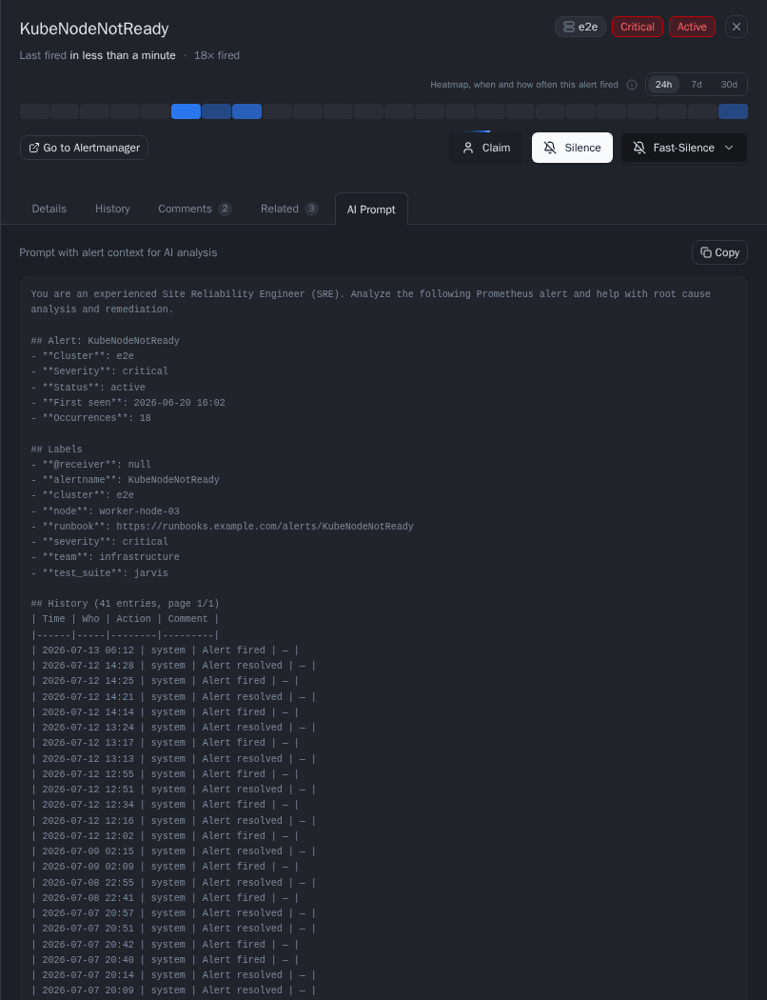

- Generates a ready-to-paste prompt for an LLM (alert name, cluster, severity, labels, annotations, and the recent history table), framed as an SRE root-cause-analysis request
- One-click copy to clipboard — paste directly into Claude, ChatGPT, or any other AI assistant to get a head start on investigation

**Claim ownership** (available regardless of tab)
- Claim the alert to signal to your team that you are actively handling it
- The claim is stored in Jarvis's database and survives page refreshes and restarts
- Other team members can see who has claimed an alert on both the card and list view
- Unclaim at any time

When an alert is claimed, the owner's name appears as a chip in the detail panel header and as an "In progress" banner on the alert card. The claim history is recorded in the History tab.

**Silence controls**
- Create a new silence directly from the panel — the form opens pre-filled with the alert's labels
- Extend or delete an existing silence if the alert is currently suppressed

---

## Firing Heatmap

At-a-glance history of how often an alert has fired recently — a compact grid, not a full event log.

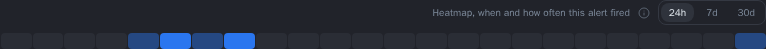

Every alert's stats line in the detail panel carries a box-grid heatmap: each cell is one time bucket, and darker/filled cells mean the alert fired more often in that bucket — an empty cell means it didn't fire. A **24h / 7d / 30d** range toggle switches the bucketing:
- **24h** — one row of hourly buckets
- **7d** — one row per day, each with 24 hourly buckets (with day labels)
- **30d** — one row of daily buckets

Hover the info icon next to the heatmap label for the same explanation inline. Hovering an individual cell shows an exact count and time range tooltip.

The same box-grid rendering (`HeatmapCellsRow`) also drives a smaller, decorative **firing sparkline** on each alert card — the most recent 14 daily buckets under the timestamp row, with no tooltips (so it doesn't fight the card's own click target):

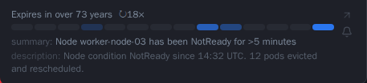

Both are read-only glance information — there's nothing to click or configure. Data comes from Jarvis's own persisted event history (`GET /api/v1/alerts/:fingerprint/heatmap`), so it reflects the full recorded lifecycle of the alert, not just what happened since Jarvis last restarted.

---

## Create Silence

Matcher builder with duration picker and a live preview of which alerts the silence will affect.

The silence creation form is designed to make it fast and safe to create silences without mistakes. The most dangerous part of silencing is being too broad — silencing more than you intended. Jarvis mitigates this with an interactive matcher builder and a live preview that shows exactly what will be silenced before you commit.

**Matcher builder:**
- Select any label key from a dropdown populated with labels from your current alerts
- Choose the operator (`=` / `!=` / `=~` / `!~`)
- Enter the value — regex values are validated immediately
- Add as many matchers as needed; all are ANDed

**Duration:**
- A days / hours / minutes spinner — set any duration you need
- Or switch to calendar mode to pick an exact end date and time
- Start time defaults to now but can be adjusted

**Live match count:**
- A counter next to the matcher rows shows how many currently firing alerts match — updates as you edit matchers
- Full affected-alert list is shown on the separate **Preview step** before submitting, so you can verify the blast radius before creating the silence

Silences are sent directly to Alertmanager via Jarvis's API proxy and are effective immediately. No need to open the native Alertmanager UI.

---

## Silence from Alert

One-click silence creation pre-filled from an alert's labels — no manual matcher entry.

During an active incident, switching to the Alertmanager UI to create a silence costs time and focus. Jarvis eliminates this by letting you create a silence directly from any alert, with all matchers pre-filled.

**How it works:**
1. Open an alert's detail panel (or click "Silence" directly on a card)
2. The silence form opens with the alert's full label set pre-populated as exact-match matchers
3. Review the matchers — remove labels to broaden the scope, or switch to regex for flexibility
4. Set a duration and submit

**Common patterns:**
- **Precise silence:** Keep all labels → silences only this exact alert instance
- **Broader silence:** Remove `instance` label → silences all instances of this alert
- **Pattern silence:** Change `=` to `=~` on the job label → silences all alerts from a job matching a regex

The live preview updates as you modify matchers, so you always know exactly which alerts the silence will cover before creating it.

---

## Fast-Silence

One-click, form-free silence on any active alert — hover the button, pick a duration.

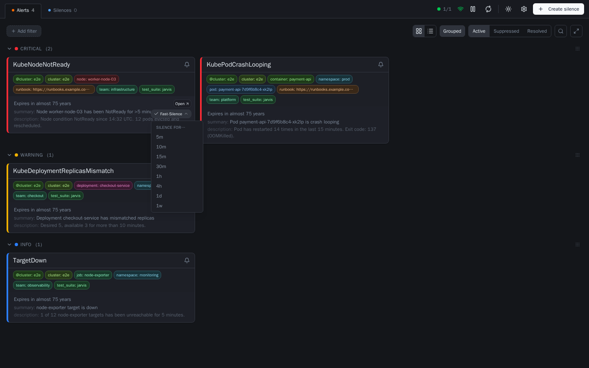

[Silence from Alert](#silence-from-alert) still requires opening the form, reviewing matchers, and submitting — the right choice when you want control over scope. Fast-Silence is for the common case: you know exactly which alert (or group of alerts) you want to quiet, right now, without leaving the alert list.

**How it works:**
1. In card view, every alert entry has a small bell icon in its persistent action column on the right — no hovering needed to find it. The card header carries the same bell icon for the whole visible group.
2. Hovering (or focusing/tapping) the bell opens a menu: **Silence…** at the top opens the full pre-filled form (see [Silence from Alert](#silence-from-alert)); below it, **Fast-Silence for…** lists durations — `5m`, `10m`, `15m`, `30m`, `1h`, `4h`, `1d`, `1w`.
3. Picking a duration on a single alert's bell creates one exact-match silence for that alert's real labels, no form involved. Picking a duration on the **card header's** bell creates one broader silence per cluster represented in the group (normally just one) — matchers use the same common-vs-varying label logic as the "Silence…" form's own group prefill (exact match on labels shared by every alert, regex-OR match on labels that vary, e.g. `pod`), so it covers exactly the same scope a reviewed form submission would default to.

The same bell + menu pattern is also available (without the group case) on list-view rows and in the alert detail panel. Each created silence's comment is auto-filled as `Fast-Silence for <duration>` so its origin is clear later in the [Active Silence](#active-silence) view or Alertmanager itself. The button shows a transient "Silenced" confirmation immediately, before the next poll flips the alert(s) to suppressed.

The per-alert bell is only shown while that alert is active (invariant: it disappears once suppressed or resolved); the card header's bell stays available regardless of state, since its "Silence…" form link is still useful for a resolved group, but its Fast-Silence section hides itself once nothing in the group is active. Every path respects the same authentication gate as other write actions — in `write_protect` mode, picking a duration prompts login first.

---

## Silence Templates

Reusable matcher sets that pre-fill the silence form in one click — no manual re-entry for recurring silences.

When the same silence patterns come up repeatedly — scheduled maintenance windows, known flaky checks, team-specific noise — it is tedious to re-enter matchers every time. Silence templates let you save a named set of matchers and a reason once, then apply them in a single click.

**How to use templates:**
1. Open the silence creation form via "Create silence" in the header
2. Switch to the **Templates** tab
3. Click any template to instantly load its matchers into the form
4. Adjust the duration and creator if needed, then submit as normal

**Creating and managing templates:**

In the Templates tab, click **+ New Template** to define a new one:
- Give it a name (e.g. "Prod Maintenance", "Node Reboot")
- Add matchers exactly like in the silence form
- Optionally add a reason / note for context
- Save — the template is stored in Jarvis and available to all users immediately

Templates can be edited or deleted from the same tab. They are stored server-side in the Jarvis database and shared across all users of the instance.

**Why this matters:**
During an incident the last thing you want to do is look up which label combination to silence. Having a "Node Reboot" template means the matcher for `alertname = KubeNodeNotReady` is one click away, with the right scope already set.

---

## Expiring Silence

Alerts with a silence that expires within 15 minutes are surfaced as active so they don't catch the team off guard.

This is one of Jarvis's most operationally important behaviors, and one that does not exist in most Alertmanager frontends.

**The problem it solves:**
You create a 4-hour silence during an incident and fix the underlying issue — but the fix turns out to be incomplete. The silence expires, the alert re-fires, and the on-call engineer gets paged. In a noisy environment this is easy to miss, especially at 3am.

**What Jarvis does:**
Any alert that is currently suppressed but whose covering silence expires within **15 minutes** is automatically reclassified as active and moved to the top of the active alert list. A distinct warning indicator shows that the alert is "expiring soon" rather than freshly firing.

**This gives the on-call engineer time to:**
- Extend the silence if the fix is still in progress
- Verify that the underlying issue is actually resolved
- Hand off context to the next person before going off-call

The 15-minute threshold is intentional: long enough to act, short enough to not cause premature noise. The reclassification logic runs entirely in the frontend (`lib/alertUtils.ts`) and updates in real time as silences approach expiry.

---

## Active Silence

Suppressed alerts show the exact silence that covers them, including remaining duration.

When an alert is suppressed, the question "why is this not firing?" should have an immediate, visible answer. Jarvis surfaces the complete context of the covering silence directly on the alert.

Suppressed alerts (covered by a silence with more than 15 minutes remaining) are accessible via the URL parameter `?state=suppressed`. Alerts whose silence expires within 15 minutes are automatically surfaced in the Active view — see [Expiring Silence](#expiring-silence).

**What is shown for each suppressed alert:**
- **Silence ID** — with a direct link to edit it
- **Matchers** — the exact matchers that cover this alert, so you can understand the scope
- **Created by** — who created the silence and when
- **Comment** — the reason/note left when the silence was created
- **Expiry countdown** — how much time is left before the silence expires, updated in real time
- **Actions** — extend or delete the silence with a single click

**Why this matters:**
In teams with multiple on-call engineers or frequent handoffs, it is common to find an alert suppressed by a silence that nobody on the current shift remembers creating. Surfacing the full silence metadata directly on the alert makes it immediately clear what is covered, why, and for how long — without any additional navigation.

---

## Alert Search

Full-text search across alert names and label values — results filter instantly as you type.

The search bar is available in the header on all alert views (active, suppressed, resolved). Entering a search term narrows the visible alerts to those whose alert name or any label value contains the typed string (case-insensitive). Search composes with active label-filter chips — both conditions must be satisfied for an alert to appear.

**What is matched:**
- Alert name (`alertname` label)
- All label values (e.g. instance, job, namespace, …)

The search term is not persisted in `localStorage` or the URL — it resets on page reload, making it a lightweight triage tool rather than a shareable filter. For persistent, shareable filtering use the label-matcher chips instead (see [Label Filters](#label-filters)).

---

## Dark / Light Theme

Switch between dark and light mode at any time; the preference is persisted in `localStorage`.

| Dark Mode | Light Mode |
|:---:|:---:|
| 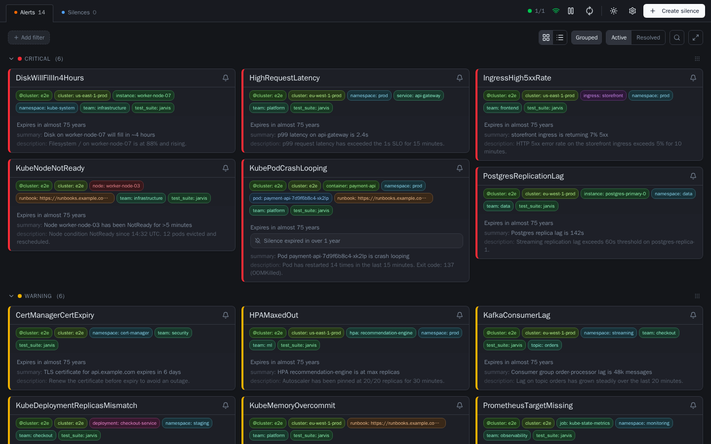 | 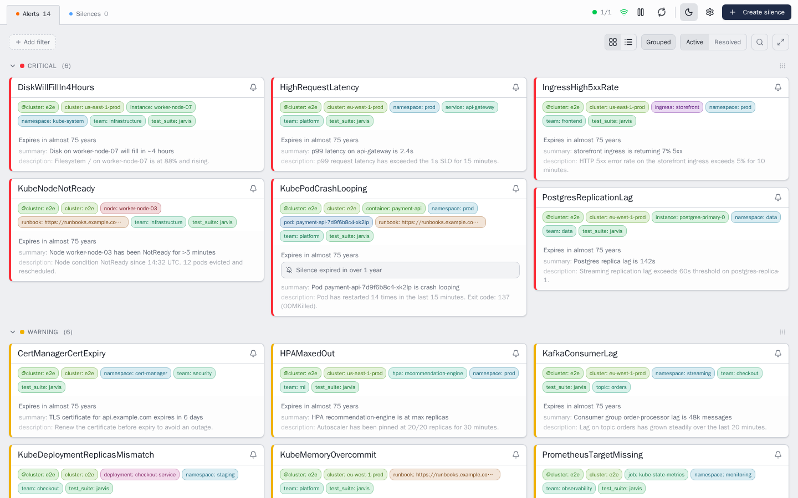 |

The theme toggle is located in the top-right corner of the header. Clicking the icon switches the entire UI between dark and light mode instantly — no page reload required.

The selected theme is saved in `localStorage` and restored on every subsequent visit. Dark mode is the default when no preference has been saved.
