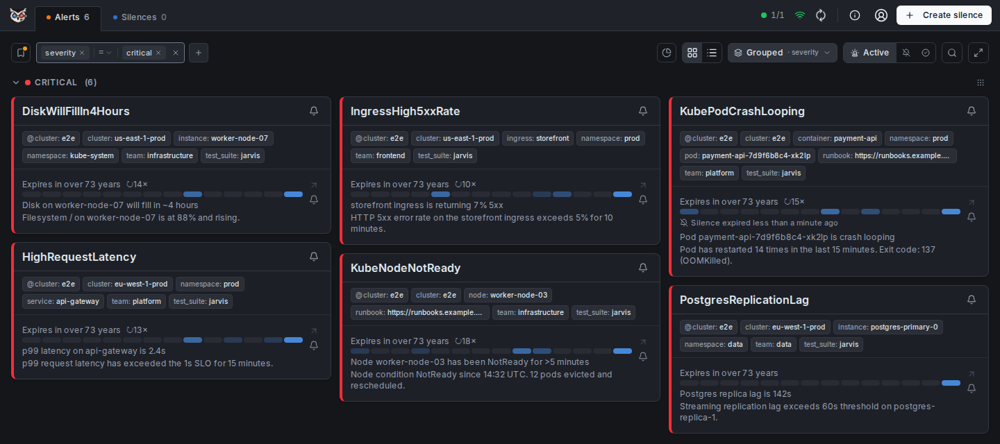
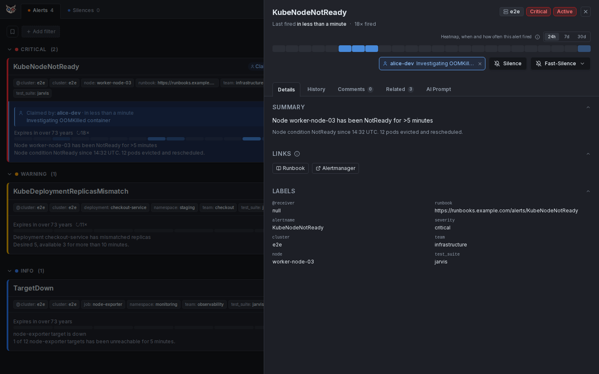
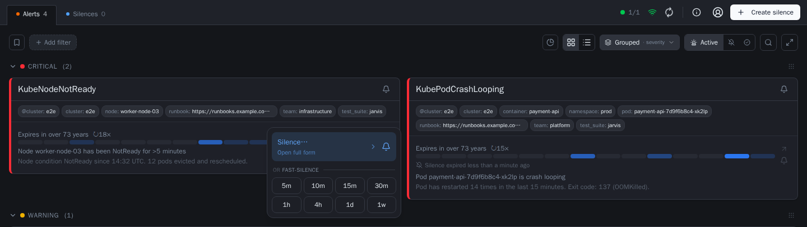
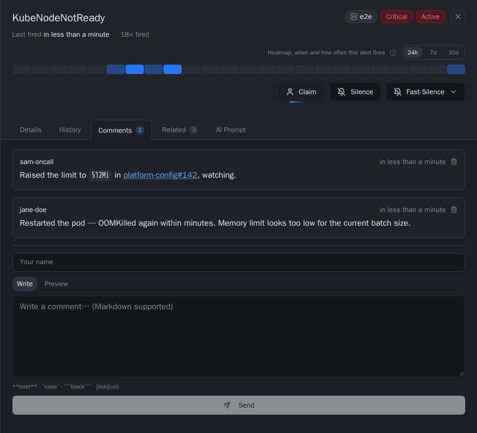

# Getting Started

Start here after opening Jarvis for the first time. Four things you will
actually do in the UI are walked through once each:
filtering, claiming, silencing, and commenting. Five minutes, no
infrastructure changes.

This assumes Jarvis is already open with some alerts in it — either the
[Local demo](demo.md) or your own deployment. Everything here works the same
in both. For the complete list of every feature, not just these four, see
[Features](features.md).

Need Jarvis first? Start with the zero-configuration [Local demo](demo.md),
[install with Compose](deploy-compose.md), or [install on Kubernetes](deploy-kubernetes.md).

- [Filter to what you care about](#filter-to-what-you-care-about)
- [Claim an alert](#claim-an-alert)
- [Silence an alert](#silence-an-alert)
- [Comment on an alert](#comment-on-an-alert)

---

## Filter to what you care about

The fastest way to narrow the list: click any label directly on an alert
card — the severity badge, a namespace, a team label — and Jarvis adds an
exact-match filter for it immediately. No typing required.

To build a filter by hand instead, use the filter bar above the alert list:
pick a label from the dropdown, choose an operator (`=`, `!=`, `=~`, `!~`),
and enter a value. Each one becomes a chip; multiple chips are ANDed
together, so `severity=critical` plus `team=platform` shows only alerts
matching both.

Two pseudo-fields are useful immediately: `@age > 15m` finds alerts that
have been firing for a while, and `@claimed-by = ""` finds everything nobody
has picked up yet.

The whole filter state lives in the URL, so a filtered view is a bookmark
away from anyone else on your team. To keep one permanently without relying
on a URL, click the bookmark icon at the left of the filter row and save it
under a name — one click re-applies it later, and one of your saved filters
can be marked as the default view Jarvis opens with.

Full matcher syntax, every pseudo-field, and saved filters in detail:
[Label Filters](features.md#label-filters).

## Claim an alert

Claiming says "I am handling this" to everyone else looking at the same
list, and it survives page reloads and restarts because it is stored in
Jarvis's own database, not just in your browser.

Open an alert's detail panel (click anywhere on its card or list row) and
claim it there. Once claimed, the owner's name shows up as a chip in the
detail panel header and as a "Claimed by: `<name>` · `<time>`" line on the
card and list row, so the rest of the team sees it without opening anything.
Unclaim the same way, any time.

A claim is not permanent: if the alert resolves and stays resolved past a
short grace window, Jarvis releases the claim automatically rather than
leaving a stale owner on an alert nobody is looking at anymore — see
[Claim ownership](features.md#alert-detail-panel) and
[the grace period](alert-lifecycle.md#the-grace-period--ghost-resolve-prevention)
for why that delay exists.

## Silence an alert

Two ways to silence, depending on how much control you need.

**Fast, no form:** every alert entry has a bell icon in its action column.
Hover (or tap) it and pick a duration — `5m` up to `1w`. This creates an
exact-match silence for that alert's real labels immediately, no review
step. The card header carries the same bell for the whole visible group, if
you want one silence covering all of it instead of one alert at a time.

**Reviewed, full control:** click "Silence…" at the top of that same menu
(or "Create silence" in the header, for a silence not tied to one alert) to
open the full form. It pre-fills matchers from the alert's labels, and a
live preview shows exactly how many currently firing alerts would be
covered before you submit — remove a label to broaden the scope, or switch
an operator to `=~` for a regex match across a whole class of alerts.

Recurring silences (a maintenance window, a known-flaky check) are worth
saving as a template so the matchers do not have to be re-entered next time
— see [Silence Templates](features.md#silence-templates).

Details on both paths: [Silence from Alert](features.md#silence-from-alert),
[Fast-Silence](features.md#fast-silence), [Create Silence](features.md#create-silence).

## Comment on an alert

Open the detail panel and switch to the **Comments** tab. Comments are
freeform Markdown, bound to the alert's fingerprint rather than to one
firing — so if the alert resolves and fires again next week, the comment
history from this week is still there. That is the one place worth writing
down an investigation step or a link to a ticket, rather than in chat, where
the next person on-call for this alert will not think to look.

More on what the tab supports: [Detail Panel — Comments](features.md#alert-detail-panel).

---

Unfamiliar terms above — episode, fingerprint, grace period, claim — are
defined in the [Glossary](glossary.md). The complete feature set, including
card vs. list view, grouping, the resolved view, and settings, is in
[Features](features.md).
